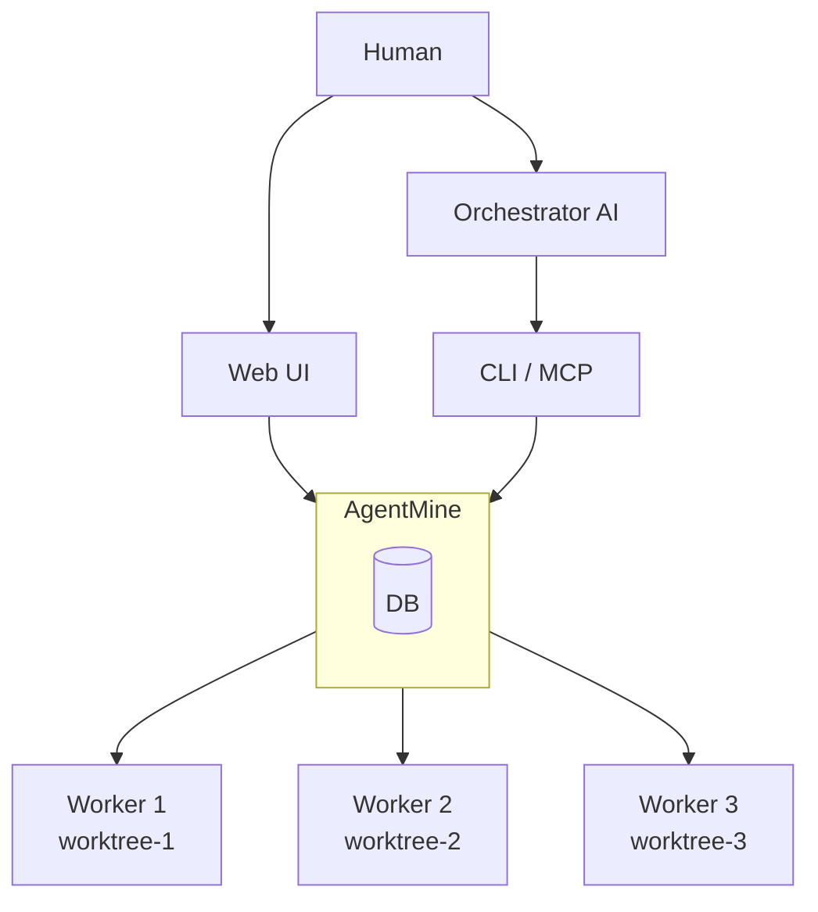

# AgentMine

**Safe Parallel AI Development Environment**

[](https://opensource.org/licenses/MIT)
[](https://www.typescriptlang.org/)

English | [日本語](./README.md)

---

## Overview

AgentMine is an execution environment for running multiple AI agents in parallel. With Git worktree isolation and scope control, multiple AIs can safely work on different tasks simultaneously.

### Core Value

| Value | Description |
|-------|-------------|
| Parallel AI Management | Isolate with Git worktree, run multiple AIs simultaneously |
| Scope Control | Physical access restrictions via sparse-checkout + chmod |
| Human-AI Collaboration | Humans use Web UI, AI uses CLI/MCP. Same DB shared |

---

## Architecture



| Role | Description |
|------|-------------|
| Orchestrator | Plans and monitors parallel execution (AI like Claude Code, or human) |
| AgentMine | Manages worktrees, applies scope, records sessions |
| Worker | Creates code in isolated worktree (auto-approval mode) |

Details: [Orchestrator/Worker Model](./docs/03-core-concepts/orchestrator-worker.md)

---

## Installation

```bash
npm install -g agentmine
agentmine init
```

| Environment | Configuration |
|-------------|---------------|
| Default | SQLite (no configuration needed) |
| PostgreSQL | Set `AGENTMINE_DB_URL` environment variable |

---

## Usage

### Web UI (For Humans)

```bash
agentmine ui
```

Access `http://localhost:3333` for task management, Worker startup, and monitoring.

### CLI (For Orchestrator AI / Scripts)

```bash
# Task management
agentmine task add "Implement auth feature" -t feature
agentmine task list

# Worker execution
agentmine worker run 1 --exec --detach  # Background
agentmine worker wait 1 2 3              # Wait for completion
agentmine worker done 1                  # Cleanup
```

### MCP (For Orchestrator AI)

`~/.config/claude/claude_desktop_config.json`:

```json
{
  "mcpServers": {
    "agentmine": {
      "command": "npx",
      "args": ["agentmine", "mcp", "serve"]
    }
  }
}
```

---

## Scope Control

Control file access range with Agent definitions:

```yaml
name: coder
scope:
  exclude: ["**/*.env", "**/secrets/**"]  # Physically excluded
  read: ["**/*"]                          # Can read
  write: ["src/**", "tests/**"]           # Can edit
```

| Scope | Implementation | Effect |
|-------|----------------|--------|
| exclude | sparse-checkout | File doesn't exist |
| write | chmod | Editable |
| read | Others | Read-only |

This mechanism allows safe use of auto-approval flags like `--dangerously-skip-permissions`.

Details: [Scope Control](./docs/03-core-concepts/scope-control.md)

---

## Tech Stack

| Category | Technology |
|----------|------------|
| Language | TypeScript |
| Package Manager | pnpm + Turborepo |
| CLI | Commander.js |
| Web UI | Next.js 14+ / shadcn/ui / Tailwind CSS |
| DB | PostgreSQL (main) / SQLite (sub) |
| ORM | Drizzle ORM |

### Supported AI Clients

| Client | Auto-approval Flag |
|--------|-------------------|
| Claude Code | `--dangerously-skip-permissions` |
| Codex | `--full-auto` |
| Gemini CLI | `-y` |
| Aider | `--yes` |

---

## Development

```bash
git clone https://github.com/krtw00/AgentMine.git
cd agentmine
pnpm install
pnpm dev
```

| Command | Description |
|---------|-------------|
| `pnpm dev` | Start all packages |
| `pnpm build` | Build |
| `pnpm test` | Test (75+ tests) |
| `pnpm lint` | Lint |

---

## Documentation

📚 **[Documentation Index](./docs/00-INDEX.md)**

| Audience | Documentation |
|----------|---------------|
| New Users | [Overview](./docs/01-introduction/overview.md), [Architecture](./docs/02-architecture/architecture.md) |
| Users | [Worker Lifecycle](./docs/07-runtime/worker-lifecycle.md), [CLI Design](./docs/06-interfaces/cli/overview.md) |
| Developers | [Contributing Guide](./docs/09-development/contributing.md), [Data Model](./docs/04-data/data-model.md) |

---

## License

[MIT License](./LICENSE)
