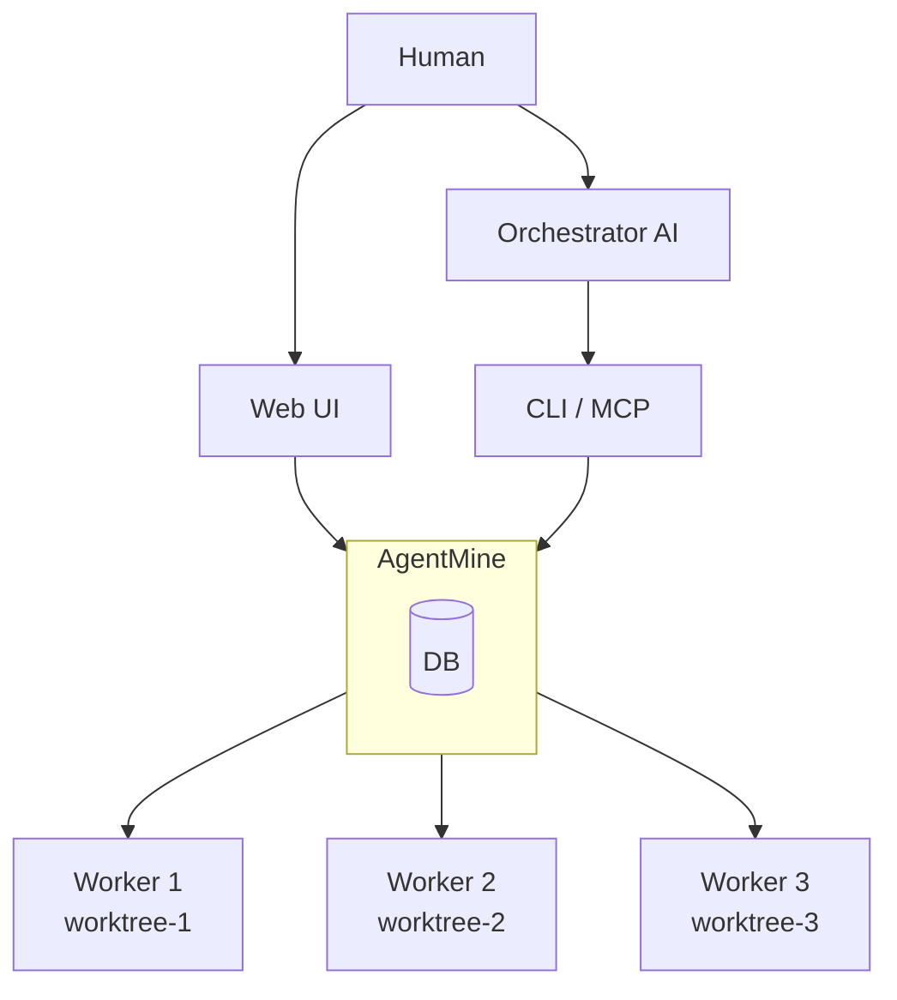

# AgentMine

**Safe Parallel AI Development Environment**

[](https://opensource.org/licenses/MIT)
[](https://www.typescriptlang.org/)

[English](./README.en.md) | 日本語

---

## 概要

AgentMineは、複数のAIエージェントを並列実行するための実行環境。Git worktreeによる隔離とスコープ制御により、複数のAIが同時に異なるタスクに安全に取り組める。

### Core Value

| 価値 | 説明 |
|------|------|
| 並列AI管理 | Git worktreeで隔離し、複数AIを同時実行 |
| スコープ制御 | sparse-checkout + chmodで物理的なアクセス制限 |
| 人間とAIの協業 | 人間はWeb UI、AIはCLI/MCP。同じDBを共有 |

---

## アーキテクチャ



| 役割 | 説明 |
|------|------|
| Orchestrator | 並列実行を計画・監視（Claude Code等のAI、または人間） |
| AgentMine | worktree管理、スコープ適用、セッション記録 |
| Worker | 隔離されたworktree内でコードを作成（自動承認モード） |

詳細: [Orchestrator/Workerモデル](./docs/03-core-concepts/orchestrator-worker.md)

---

## 開発環境（Docker）

### 必要条件

- Docker Desktop
- Traefik起動済み（`~/work/infra/traefik`）

### 起動

```bash
# Traefikネットワーク作成（初回のみ）
docker network create traefik

# Traefik起動
cd ~/work/infra/traefik && docker compose up -d

# プロジェクト起動
cd ~/work/projects/agentmine
docker compose up -d
```

### アクセス

- Web UI: http://agentmine.localhost

### コマンド

```bash
# 起動
docker compose up -d

# ログ確認
docker compose logs -f web

# 停止
docker compose down

# 再ビルド
docker compose up -d --build
```

---

## インストール（CLIツール）

```bash
npm install -g agentmine
agentmine init
```

| 環境 | 設定 |
|------|------|
| デフォルト | SQLite（設定不要） |
| PostgreSQL | `AGENTMINE_DB_URL` 環境変数を設定 |

---

## 使用方法

### Web UI（人間向け）

```bash
agentmine ui
```

`http://localhost:3333` でタスク管理、Worker起動・監視が可能。

### CLI（Orchestrator AI / スクリプト向け）

```bash
# タスク管理
agentmine task add "認証機能実装" -t feature
agentmine task list

# Worker実行
agentmine worker run 1 --exec --detach  # バックグラウンド
agentmine worker wait 1 2 3              # 完了待機
agentmine worker done 1                  # クリーンアップ
```

### MCP（Orchestrator AI向け）

`~/.config/claude/claude_desktop_config.json`:

```json
{
  "mcpServers": {
    "agentmine": {
      "command": "npx",
      "args": ["agentmine", "mcp", "serve"]
    }
  }
}
```

---

## スコープ制御

Agent定義でファイルアクセス範囲を制御：

```yaml
name: coder
scope:
  exclude: ["**/*.env", "**/secrets/**"]  # 物理的に除外
  read: ["**/*"]                          # 参照可能
  write: ["src/**", "tests/**"]           # 編集可能
```

| スコープ | 実装 | 効果 |
|---------|------|------|
| exclude | sparse-checkout | ファイルが存在しない |
| write | chmod | 編集可能 |
| read | 上記以外 | 読み取り専用 |

この仕組みにより、`--dangerously-skip-permissions`等の自動承認フラグを安全に使用できる。

詳細: [スコープ制御](./docs/03-core-concepts/scope-control.md)

---

## 技術スタック

| カテゴリ | 技術 |
|---------|------|
| 言語 | TypeScript |
| パッケージマネージャ | pnpm + Turborepo |
| CLI | Commander.js |
| Web UI | Next.js 14+ / shadcn/ui / Tailwind CSS |
| DB | PostgreSQL (メイン) / SQLite (サブ) |
| ORM | Drizzle ORM |

### 対応AIクライアント

| クライアント | 自動承認フラグ |
|-------------|--------------|
| Claude Code | `--dangerously-skip-permissions` |
| Codex | `--full-auto` |
| Gemini CLI | `-y` |
| Aider | `--yes` |

---

## 開発

```bash
git clone https://github.com/krtw00/AgentMine.git
cd agentmine
pnpm install
pnpm dev
```

| コマンド | 説明 |
|---------|------|
| `pnpm dev` | 全パッケージ同時起動 |
| `pnpm build` | ビルド |
| `pnpm test` | テスト（75+ テスト） |
| `pnpm lint` | リント |

---

## ドキュメント

📚 **[ドキュメントトップページ](./docs/00-INDEX.md)**

| 対象 | ドキュメント |
|------|------------|
| 初めての方 | [概要](./docs/01-introduction/overview.md), [アーキテクチャ](./docs/02-architecture/architecture.md) |
| 利用者 | [Worker実行フロー](./docs/07-runtime/worker-lifecycle.md), [CLI設計](./docs/06-interfaces/cli/overview.md) |
| 開発者 | [開発ガイド](./docs/09-development/contributing.md), [データモデル](./docs/04-data/data-model.md) |

---

## ライセンス

[MIT License](./LICENSE)
