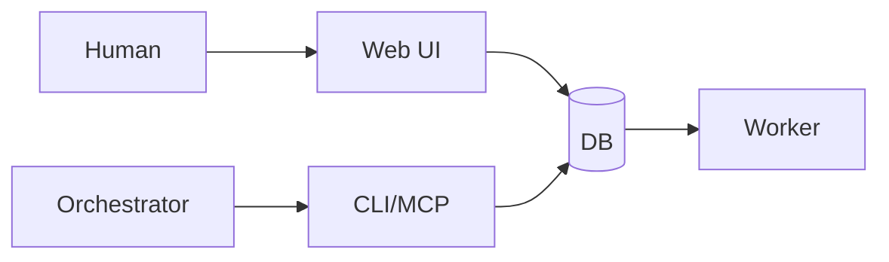

# AgentMine Overview

**Safe Parallel AI Development Environment** - 複数AIを同時に、安全に、管理可能に

## 目的

AgentMineの概要を説明する。本ドキュメントはプロジェクト概要のSSoT（Single Source of Truth）である。

## AgentMineとは

AgentMineは**並列AI開発の実行環境**。複数のAIエージェントを同時に安全に動かし、チーム全体で協業できる基盤を提供する。

## Core Value

### 1. 並列AI管理

複数のAIを**同時に、互いに干渉せず**に動かす。

| 特徴 | 説明 |
|------|------|
| 独立したworktree | 各Workerは専用のworktreeで隔離 |
| 並列実行 | 複数タスクを同時に実行可能 |
| バックグラウンド実行 | --detachオプションで非同期実行 |

### 2. スコープ制御

物理的なアクセス制限により、**安全に自動承認モード**で実行できる。

| スコープ | 実装 | 効果 |
|---------|------|------|
| exclude | sparse-checkout | 物理的に存在しない |
| write | chmod | 編集可能 |
| read | 上記以外 | 参照のみ |

機密ファイルは物理的に除外され、AIが誤って変更できない。

### 3. 人間とAIの協業

人間とAIが**同じDBを見て**協業する（Redmine的運用）。

| ユーザー | インターフェース | 役割 |
|---------|-----------------|------|
| 人間 | Web UI | タスク管理、Agent定義、Worker監視 |
| Orchestrator（AI PM） | CLI/MCP | 自動化（Claude Code等） |
| Worker（AI） | 隔離worktree | コード実装 |
| AgentMine | - | すべてのデータをDB管理（単一真実源） |

## 対象ユーザー

| ユーザー | 使い方 |
|---------|--------|
| 個人開発者 | シンプルな並列開発、SQLiteで即座に開始 |
| チーム開発 | 共有PostgreSQLでリアルタイム進捗共有 |
| Orchestrator（AI PM） | MCP経由でタスク管理・Worker制御 |

## なぜAgentMineか

### 既存ツールとの比較

| 課題 | 従来 | AgentMine |
|------|------|-----------|
| 並列実行 | 手動worktree管理 | 自動worktree＆隔離 |
| 安全性 | 人間が逐一承認 | スコープ制御で自動承認 |
| 協業 | ファイル共有・Slack | 共有DB＆Web UI |
| 状態管理 | 手動メモ | DB＆Memory Bank |

### DevHiveとの関係

AgentMineはDevHiveの後継。

| ツール | 特徴 |
|--------|------|
| DevHive | シンプルな並列AI実行（個人向け） |
| AgentMine | セキュリティ＋チーム協業＋Memory Bank |

## 動作フロー

### 1. タスク登録

| コマンド | 説明 |
|---------|------|
| agentmine task add "認証機能実装" | タスク作成 |

### 2. Worker起動

| コマンド | 説明 |
|---------|------|
| agentmine worker run 1 --exec --detach | バックグラウンドでWorker起動 |

**内部動作:**

| 手順 | 処理 |
|------|------|
| 1 | Git worktree作成（.agentmine/worktrees/task-1/） |
| 2 | スコープ適用（exclude: sparse-checkout, write: chmod） |
| 3 | Memory Bank注入（プロジェクト知識） |
| 4 | Worker AI起動（自動承認モード） |

### 3. 監視

| コマンド | 説明 |
|---------|------|
| agentmine worker status 1 | 実行状態確認 |

### 4. 完了

| コマンド | 説明 |
|---------|------|
| agentmine worker done 1 | マージ・クリーンアップ |

## 設計原則

### Single Source of Truth（DBマスター）

すべてのデータ（タスク、Agent、Memory、設定）はDBで管理。

| テーブル | 内容 |
|---------|------|
| tasks | タスク |
| sessions | セッション記録 |
| agents | Agent定義 |
| memories | Memory Bank |
| settings | 設定 |

### Observable & Deterministic

ステータスはAIの報告ではなく、**客観的事実**で判定。

| 観測対象 | 例 |
|---------|-----|
| Git commits | git.log().length |
| 終了コード | session.exitCode |
| マージ状態 | git.isMerged(branch) |

### Fail Fast

エラーは即座に失敗。リカバリーは上位層（Orchestrator）の責務。

## 次のステップ

| 対象 | 参照ドキュメント |
|------|-----------------|
| 初めての方 | @02-architecture/architecture.md |
| 利用者 | @07-runtime/worker-lifecycle.md |
| 開発者 | @08-deployment/installation.md |

## 関連ドキュメント

- ドキュメント全体ナビゲーション: @00-INDEX.md
- システムアーキテクチャ: @02-architecture/architecture.md
- 用語集: @appendix/glossary.md
