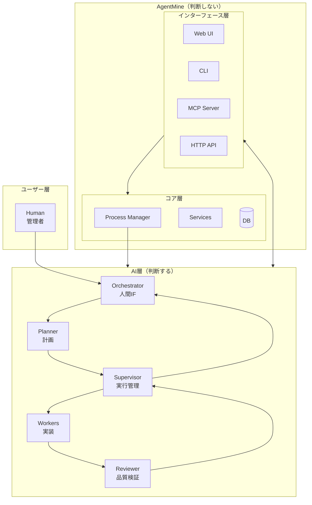
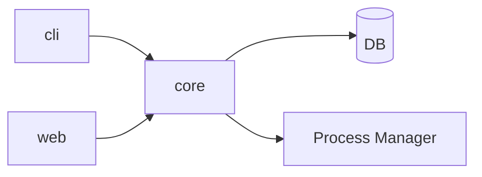
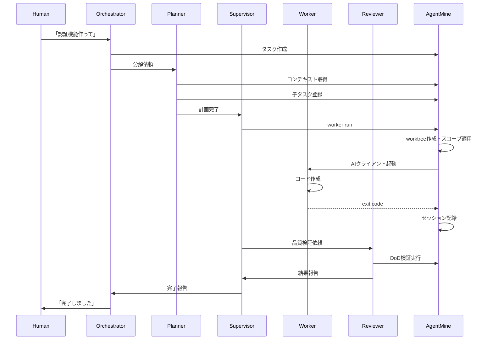
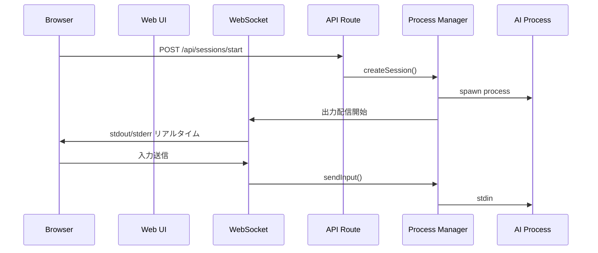

# アーキテクチャ

## 目的

このドキュメントはAgentMineのシステム構成と設計原則を説明する。

## 背景

AgentMineは「並列AI開発の実行環境」であり、「並列実行を計画するAI」ではない。

**重要原則: AgentMineは判断しない**

AgentMineはタスク管理システム（Redmine/Jira的）であり、判断材料を提供するのみ。判断はAI層（Orchestrator/Planner/Supervisor/Worker/Reviewer）が行う。

**AgentMineの責務:**
- タスク/状態管理（DB）
- Workerの隔離環境（worktree）を提供
- スコープ制御（アクセス可能なファイルの制限）
- DoD検証（lint/test/build等の品質チェック）
- プロセス管理（AIプロセスの起動・監視）
- セッションの記録
- Memory Bankの提供

**AI層の責務:**
- 並列実行の計画（Planner）
- Workerの起動・監視（Supervisor）
- 進捗監視と完了判断（Supervisor）
- 品質検証（Reviewer）
- 人間との対話（Orchestrator）

この責務分離により、**判断はAI層、実行基盤はAgentMine**という役割が明確になる。

## 設計原則

### 1. DBマスター（Single Source of Truth）

すべてのデータはDBで管理する。ファイルはスナップショット/エクスポート用。

| データ | 保存先 | 用途 |
|--------|--------|------|
| タスク | DB (tasks) | タスク管理 |
| セッション | DB (sessions) | 実行履歴 |
| Agent定義 | DB (agents) | Worker設定 |
| Memory Bank | DB (memories) | 知識蓄積 |
| 設定 | DB (settings) | プロジェクト設定 |
| 提案 | DB (proposals) | Planner分解案 |

Worker起動時にDBからファイルを出力し、Workerに渡す。

### 2. 事実ベースの状態管理

Workerは能動的にDBを更新しない。ステータスは観測可能な事実から判定する。

| 事実 | 判定 |
|------|------|
| exit code = 0 | 正常終了 |
| exit code ≠ 0 | エラー終了 |
| ブランチがマージ済み | タスク完了 |
| プロセスが存在 | 実行中 |

この方式により、WorkerとAgentMineの結合を避け、並列実行時の競合も発生しない。

### 3. Fail Fast

エラー時は即座に失敗させ、リカバリーはAI層（Planner/Supervisor）に委ねる。

AgentMineは自動リトライやエラー修正を行わない。明確な成功/失敗の状態を記録し、判断はAI層に任せる。

### 4. DoD検証の仕組み化

DoD（Definition of Done）検証はAgentMineが強制する。AI層の任意ではない。

**なぜ仕組み化するか:**
- AI層が検証をスキップしても何も起きない、という状況を避ける
- 責任の所在を明確にする（DoDが通らないとマージ不可）
- スコープ制御と同様の「安全装置」として位置づける

**動作:**
1. Worker完了後、AgentMineがDoD検証を自動実行
2. 失敗したらセッションを`dod_failed`として記録
3. マージをブロック
4. 明示的なスキップは`--skip-dod`で可能（自己責任）

### 5. AI非依存

AgentMineに判断ロジックを入れない。これにより：
- どのAI CLI（Claude Code / Codex / Gemini等）でも使える
- AIの進化・乗り換えに対応できる
- 判断と実行が明確に分離される

### 6. 人間とAIの協業（Redmine的運用）

人間のタスクもAIのタスクも同一画面で統合管理する。

**アクターモデル:** 人間とAgentを「アクター」として統一的に扱う。

| アクター種別 | 例 | ステータス管理 |
|-------------|-----|---------------|
| human | 井口さん、田中さん | 手動更新 |
| agent | Worker-1、Reviewer | 事実ベース自動判定 |

## システム構成

### レイヤー説明

**ユーザー層:** AgentMineを使う人間（管理者）

**AI層:** 判断を担当するAI群
- Orchestrator: 人間との対話、依頼受付、完了報告
- Planner: タスク分解、依存関係設定
- Supervisor: Worker起動、進捗監視、NG対応
- Worker: コード実装（worktreeで隔離）
- Reviewer: 品質検証、DoD確認

**AgentMine層:** 判断材料の提供と実行基盤
- Web UI: 人間向け。タスク管理、セッション可視化
- CLI: AI向け。Worker起動、状態確認
- MCP Server: AIクライアント向け。ツールとして呼び出し
- HTTP API: 汎用。どのクライアントからも利用可能
- Process Manager: AIプロセスの起動・監視・WebSocket配信
- Core Services: ビジネスロジック、DB操作

## パッケージ構成

モノレポ構成で3つのパッケージを持つ。

| パッケージ | 役割 | 主な機能 |
|------------|------|----------|
| `@agentmine/core` | 共有ロジック | DB操作、Service、Model、ProcessManager |
| `@agentmine/cli` | CLIアプリ | コマンド、MCP Server |
| `@agentmine/web` | Web UI | Next.js App、WebSocket、セッション可視化 |

CoreはCLIとWebの両方から利用される。

## データフロー

### 5層セッション起動時

### Web UIからの操作

## DB戦略

### 使い分け

| 環境 | DB | 理由 |
|------|-----|------|
| チーム開発 | PostgreSQL | 複数人での同時アクセス、リアルタイム共有 |
| 個人利用 | SQLite | セットアップ不要、ポータブル |

Drizzle ORMで両方をサポートし、環境変数で切り替える。

## 技術スタック

| カテゴリ | 技術 | 選定理由 |
|---------|------|----------|
| 言語 | TypeScript | 型安全、IDE支援 |
| モノレポ | pnpm + Turborepo | 高速、キャッシュ対応 |
| CLI | Commander.js | 標準的、ドキュメント充実 |
| ORM | Drizzle | 型安全、軽量、SQLite/PG両対応 |
| Web | Next.js (App Router) | React最新、SSR対応 |
| UI | shadcn/ui + Tailwind | カスタマイズ性、モダン |
| リアルタイム | WebSocket | 双方向通信、プロセス出力配信 |
| プロセス管理 | Node.js child_process | OS非依存 |
| テスト | Vitest | 高速、TypeScript対応 |

## セキュリティ考慮

### Worker隔離

各Workerは独立したgit worktreeで作業する。互いのファイルにアクセスできない。

### スコープ制御

Workerがアクセスできるファイルを物理的に制限する。

| スコープ | 物理的状態 | 説明 |
|---------|-----------|------|
| exclude | ファイルが存在しない | sparse-checkoutで除外 |
| read | 読み取り専用 | 参照可能 |
| write | 書き込み可能 | 編集可能 |

制限があることで、AIの自動承認モードを安全に使える。

### DoD検証

Worker完了後にlint/test/build等を自動実行する。失敗したらマージをブロック。

スコープ制御が「何にアクセスできるか」を制限するのに対し、DoD検証は「何を満たせばマージできるか」を保証する。両方を組み合わせることで、AIの自動承認モードを安全に使える。

### 認証情報

APIキー等はDBに保存せず、環境変数で管理する。

## 関連ドキュメント

- 概要: @01-introduction/overview.md
- 5層アーキテクチャ: @03-core-concepts/orchestrator-worker.md
- セッションフロー: @07-runtime/worker-lifecycle.md
- スコープ制御: @03-core-concepts/scope-control.md
- データモデル: @04-data/data-model.md
- Web UI: @06-interfaces/web/overview.md
- ADR-007 5層アーキテクチャ: @10-decisions/007-five-layer-architecture.md
- ADR-008 プロセス管理: @10-decisions/008-process-management-webui.md
- 用語集: @appendix/glossary.md
