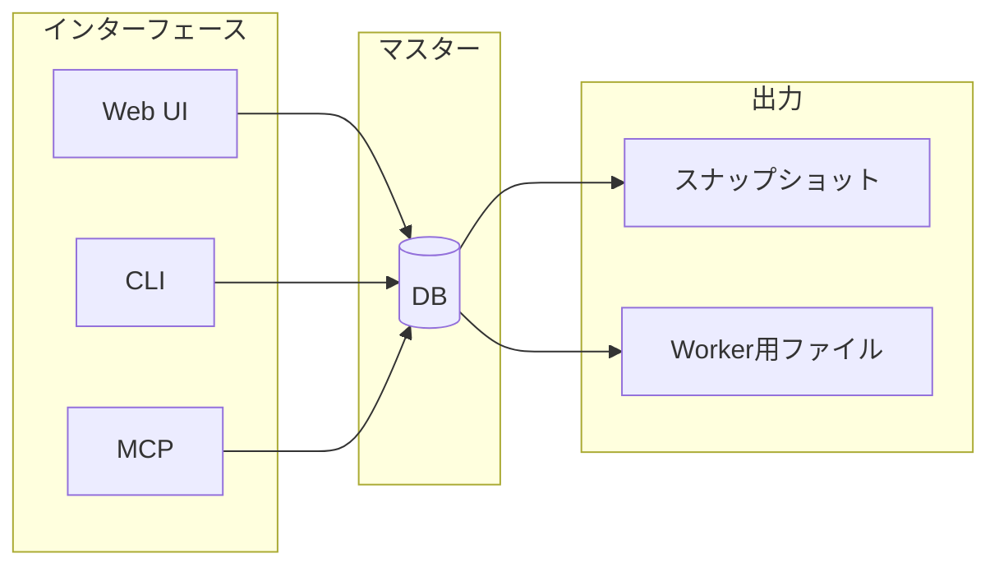
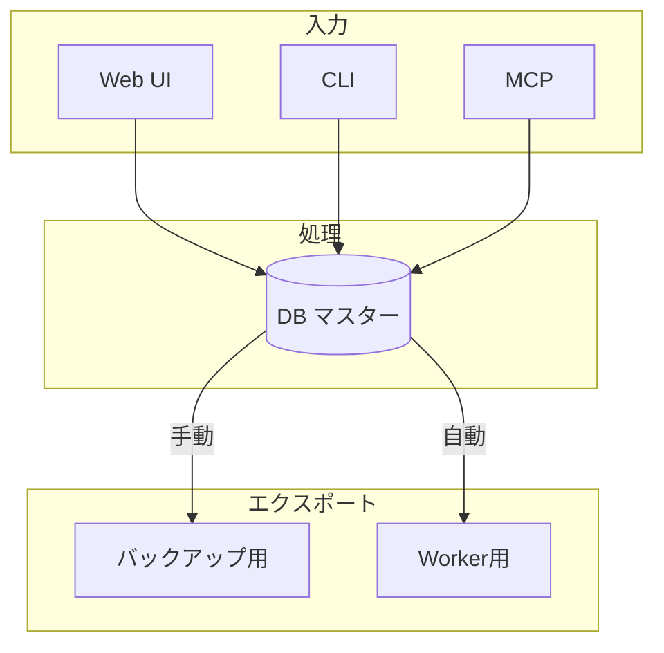

# DBマスター方式

## 目的

AgentMineのデータ管理戦略を定義する。本ドキュメントはDBマスター方式のSSoT（Single Source of Truth）である。

## 背景

AgentMineは複数のインターフェース（Web UI、CLI、MCP）からアクセスされる。データの一貫性を保つには、単一のマスターデータソースが必要。

**なぜDBマスターか:**
- チーム全員が同じデータを参照できる
- リアルタイム共有が可能
- 変更履歴を自動管理できる
- 検索・フィルタリングが効率的

## 設計原則

すべてのデータはDBで管理する。ファイルはスナップショット/エクスポート用のみ。

## DB管理されるデータ

| データ | テーブル | スナップショット出力 | 用途 |
|--------|---------|---------------------|------|
| タスク | tasks | - | タスク管理 |
| セッション | sessions | - | 実行履歴 |
| Agent定義 | agents | .agentmine/agents/*.yaml | バックアップ・移行 |
| Memory Bank | memories | worktree/.agentmine/memory/ | Worker参照 |
| 設定 | settings | .agentmine/config.yaml | バックアップ・移行 |
| 監査ログ | audit_logs | - | 監査 |
| 履歴 | *_history | - | 変更履歴 |

## なぜDBマスターが必要か

### 1. データ整合性

| 方式 | 問題 | 結果 |
|------|------|------|
| ファイルベース | 同じ情報が複数箇所に存在 | 更新漏れ、情報の不一致 |
| DBマスター | 1箇所で管理 | 常に一貫性が保証される |

### 2. リアルタイム共有

| 方式 | 動作 | チーム協業 |
|------|------|-----------|
| ファイルベース | ファイル同期が必要 | 遅延・コンフリクト発生 |
| DBマスター | 即座に反映 | シームレス |

### 3. 変更履歴

| 方式 | 履歴管理 | トレーサビリティ |
|------|---------|----------------|
| ファイルベース | Gitに依存 | コミット単位でしか追えない |
| DBマスター | 履歴テーブルで自動管理 | いつ誰が何を変更したか追跡可能 |

### 4. 検索効率

| 方式 | 検索方法 | パフォーマンス |
|------|---------|---------------|
| ファイルベース | grep、全ファイル読み込み | 遅い |
| DBマスター | SQLクエリ、インデックス | 高速 |

## データフロー

### 作成・更新フロー

### Worker実行時フロー

| 手順 | 操作 | 出力先 |
|------|------|--------|
| 1 | Agent定義取得 | promptContent生成 |
| 2 | Memory Bank取得 | worktree/.agentmine/memory/ |
| 3 | 設定取得 | スコープ適用 |

## スナップショット vs DB

### スナップショット（ファイル）の用途

| 用途 | 説明 |
|------|------|
| バックアップ | 定期的なデータ保存 |
| 移行 | プロジェクト間のコピー |
| Worker参照 | read-only参照 |
| Git管理 | 必要な場合のみ |

### スナップショットの非用途

| 非用途 | 理由 |
|--------|------|
| リアルタイム編集 | DBで行う |
| 真実源 | あくまでスナップショット |

## エクスポート・インポート

### エクスポート（DB → ファイル）

| コマンド | 出力 |
|---------|------|
| agentmine export --output ./backup/ | 全データ |
| agentmine agent export coder | Agent定義 |
| agentmine memory export | Memory Bank |

### インポート（ファイル → DB）

| コマンド | 用途 |
|---------|------|
| agentmine db import --from .agentmine/ | 旧バージョンからの移行 |
| agentmine agent import --file ./coder.yaml | 個別インポート |
| agentmine memory import --dir ./memory/ | Memory移行 |

## Git連携

### .gitignore戦略

| 対象 | Git管理 | 理由 |
|------|---------|------|
| .agentmine/ | 除外 | DBがマスターなので不要 |
| docs/memory/ | 任意 | 必要ならエクスポート先を変更 |

**設計意図:** DBがマスターなので、スナップショットをリポジトリに含める必要がない。必要な場合はエクスポート先を別ディレクトリに指定する。

## DB戦略

| 環境 | DB | 用途 | 接続方法 |
|------|-----|------|---------|
| チーム開発 | PostgreSQL | 共有DB、リアルタイム協業 | DATABASE_URL環境変数 |
| 個人利用 | SQLite | お試し、オフライン | デフォルト（.agentmine/data.db） |

## メリット・デメリット

### メリット

| メリット | 説明 |
|---------|------|
| データ整合性 | 1箇所更新で全て最新 |
| リアルタイム共有 | チーム全員が同じデータ |
| 変更履歴 | いつ誰が何を変更したかトレース |
| 検索効率 | SQL/ORMで高速クエリ |
| トランザクション | 複数変更の原子性保証 |

### デメリット

| デメリット | 対策 |
|-----------|------|
| DB必須 | SQLiteでゼロ設定対応 |
| 移行コスト | importコマンドで対応 |
| Git Diff不可視 | 必要ならエクスポートしてGit管理 |

## よくある質問

| 質問 | 回答 |
|------|------|
| ファイルを直接編集したら反映される？ | いいえ。DBを更新する必要がある |
| スナップショットをGit管理すべき？ | 基本不要。必要ならエクスポート先を変更 |
| DBが壊れたら？ | 定期エクスポートでバックアップを取る |
| オフラインで作業できる？ | SQLiteを使えば可能 |

## 関連ドキュメント

- アーキテクチャ: @02-architecture/architecture.md
- データモデル: @04-data/data-model.md
- DB選定ADR: @10-decisions/002-sqlite-default.md
- 用語集: @appendix/glossary.md
