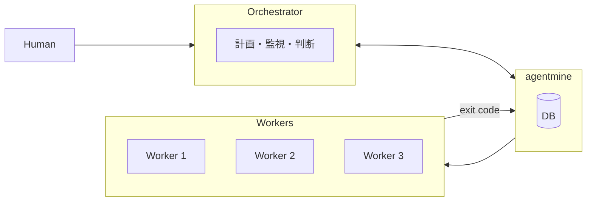
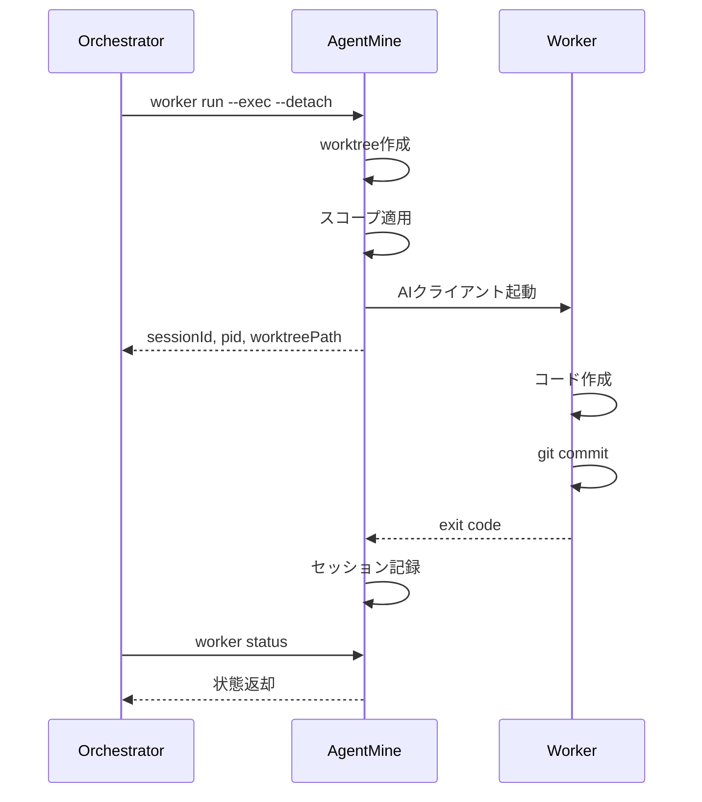

# Orchestrator / Worker モデル

## 目的

AgentMineの中核アーキテクチャパターンを定義する。本ドキュメントはOrchestrator/WorkerモデルのSSoT（Single Source of Truth）である。

## 背景

AIを使った並列開発では、「計画・判断」と「実行」を分離する必要がある。1つのAIがすべてを担当すると、複雑化してエラーが発生しやすくなる。

**なぜOrchestrator/Workerか:**
- 責務分離により各役割が専念できる
- Workerを増やすことで並列度を向上できる
- Worker隔離により安全性を確保できる

## 概要図

## 役割定義

### Orchestrator

| 項目 | 内容 |
|------|------|
| 定義 | 並列実行を計画・監視するAIクライアント、または人間 |
| 典型例 | Claude Code、Codex、Gemini CLI、人間 |

**責務:**

| 責務 | 説明 |
|------|------|
| 計画 | タスクを分析し、並列実行戦略を決定 |
| 起動 | agentmine worker run でWorkerを起動 |
| 監視 | Worker状態を監視 |
| マージ判断 | DoD結果を確認し、マージ実行を判断 |
| PR作成 | 完成したコードをPRにまとめる |

**やらないこと:**

| 非責務 | 理由 |
|--------|------|
| コード作成 | Workerの仕事 |
| worktree内での作業 | Workerの領域 |

### Worker

| 項目 | 内容 |
|------|------|
| 定義 | 隔離されたworktree内でコードを書くAIエージェント |
| 作業場所 | .agentmine/worktrees/task-{id}/ |

**特徴:**

| 特徴 | 説明 |
|------|------|
| 隔離 | 専用worktreeで作業 |
| スコープ制御 | アクセス可能なファイルが制限 |
| 非接続 | AgentMineにアクセスしない |
| 自動承認 | 自動承認モードで実行 |

**責務:**

| 責務 | 説明 |
|------|------|
| コード作成 | タスクに従ってコードを書く |
| テスト追加 | 必要なテストを作成 |
| コミット | 変更をコミット |

**やらないこと:**

| 非責務 | 理由 |
|--------|------|
| タスク管理 | Orchestratorの仕事 |
| 他Workerとの通信 | 隔離されている |
| マージ判断 | Orchestratorの仕事 |
| agentmine CLI実行 | 隔離されている |

### AgentMine

| 項目 | 内容 |
|------|------|
| 定義 | Blackboard（共有データ領域）兼実行基盤 |

**責務:**

| 責務 | 説明 |
|------|------|
| データ管理 | DB（tasks, sessions, agents, memories） |
| worktree管理 | 作成・削除・スコープ適用 |
| Worker起動 | AIクライアント実行 |
| DoD検証 | lint/test/build等の品質チェック実行 |
| セッション記録 | exit code, artifacts, duration, DoD結果 |
| Memory Bank提供 | プロジェクト決定事項の注入 |

**やらないこと:**

| 非責務 | 理由 |
|--------|------|
| 並列実行の計画 | Orchestratorの仕事 |
| マージ判断 | Orchestratorの仕事 |
| リトライ判断 | Orchestratorの仕事 |
| コード作成 | Workerの仕事 |

## 通信フロー

### Orchestrator → AgentMine → Worker

### Workerの隔離

| 観点 | 説明 |
|------|------|
| AgentMineアクセス | 不可 |
| 他Workerとの通信 | 不可 |
| 情報伝達 | exit codeのみ |

## 典型的な実行フロー

| 手順 | 実行者 | 操作 |
|------|--------|------|
| 1 | Orchestrator | タスク取得（agentmine task list） |
| 2 | Orchestrator | Worker並列起動（worker run --exec --detach） |
| 3 | AgentMine | worktree作成、スコープ適用、Worker起動 |
| 4 | Worker | コード作成、テスト追加、コミット |
| 5 | Orchestrator | 完了待ち（worker wait） |
| 6 | AgentMine | DoD検証（lint/test/build）、結果をDBに記録 |
| 7 | Orchestrator | DoD結果を確認、マージ判断・実行 |
| 8 | Orchestrator | 完了処理（worker done） |

## 利点

| 利点 | 説明 |
|------|------|
| 責務分離 | 計画・判断・実行がそれぞれ専念できる |
| 柔軟性 | Orchestratorが状況に応じて戦略を変更可能 |
| スケーラビリティ | Workerを増やすことで並列度を向上 |
| 安全性 | Worker隔離により互いに干渉しない |

## Workerが受け取る情報

| 情報 | 内容 |
|------|------|
| タスク | ID、タイトル、説明 |
| Agent指示 | promptContent |
| Memory Bank要約 | ルール、規約、アーキテクチャ等 |
| Memory参照一覧 | .agentmine/memory/配下のファイル |

## Workerのスコープ

| スコープ | 例 | 状態 |
|---------|-----|------|
| write | src/, tests/ | 編集可能 |
| read | docs/, README.md | 参照のみ |
| exclude | .env, secrets/ | 存在しない |

## よくある質問

| 質問 | 回答 |
|------|------|
| Workerは他Workerと通信できる？ | いいえ。調整はOrchestratorが行う |
| Workerが失敗したら？ | AgentMineがfailedを記録、Orchestratorがリトライ判断 |
| Orchestratorは人間でもよい？ | はい。CLIを手動実行してもOK |
| Web UIはどの役割？ | 人間用インターフェース。Orchestrator的判断はしない |

## 関連ドキュメント

- アーキテクチャ: @02-architecture/architecture.md
- Worker実行フロー: @07-runtime/worker-lifecycle.md
- スコープ制御: @03-core-concepts/scope-control.md
- 用語集: @appendix/glossary.md
