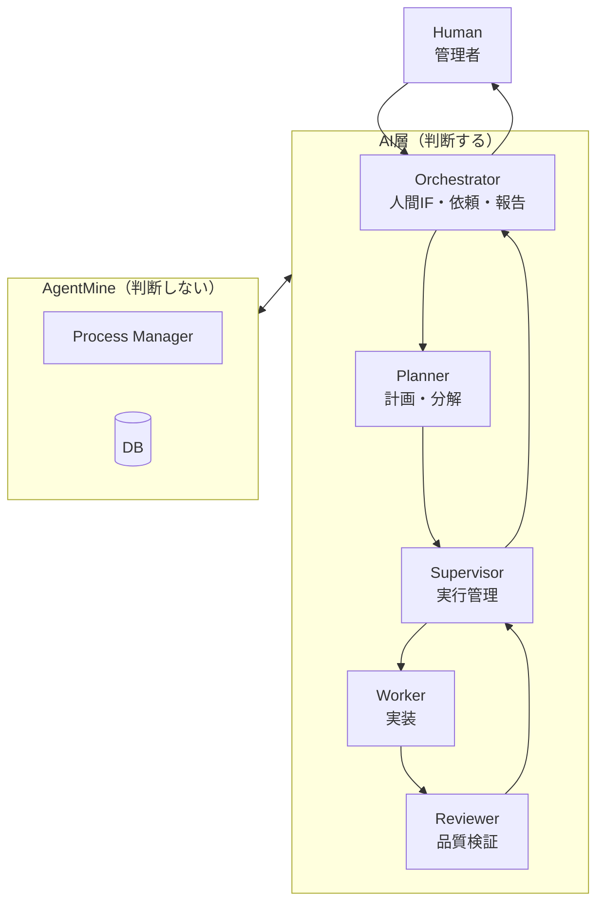
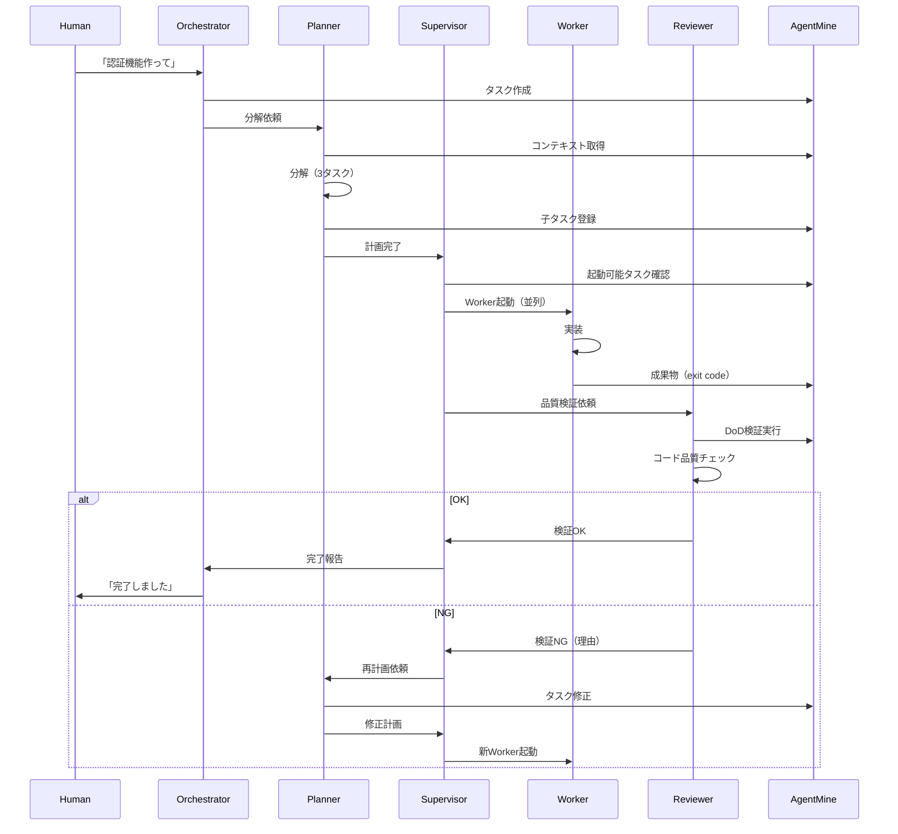

# 5層アーキテクチャ

## 目的

AgentMineの中核アーキテクチャパターンを定義する。本ドキュメントは5層アーキテクチャのSSoT（Single Source of Truth）である。

## 背景

AIを使った並列開発では、「計画・判断」と「実行」を分離する必要がある。1つのAIがすべてを担当すると、複雑化してエラーが発生しやすくなる。

**なぜ5層構造か:**
- 責務分離により各役割が専念できる
- 計画（Planner）と実行管理（Supervisor）を分けることで負荷分散
- 品質検証（Reviewer）を独立させることでNG時の責任が明確
- Workerを増やすことで並列度を向上できる
- Worker隔離により安全性を確保できる

## 概要図

## 役割定義

### Human（管理者）

| 項目 | 内容 |
|------|------|
| 定義 | AgentMineを使ってAIに仕事を依頼する人間 |
| 対応する役職 | 経営者、プロダクトオーナー |

**責務:**

| 責務 | 説明 |
|------|------|
| イシュー投入 | 何を作るか指示する |
| 検収 | 完了した成果物を確認・承認 |
| 最終判断 | 方針変更、中止判断 |

**やらないこと:**

| 非責務 | 理由 |
|--------|------|
| タスク分解 | Plannerの仕事 |
| Worker管理 | Supervisorの仕事 |
| コード作成 | Workerの仕事 |

---

### Orchestrator（人間インターフェース）

| 項目 | 内容 |
|------|------|
| 定義 | 人間との対話を担当するAI |
| 対応する役職 | 秘書、窓口担当 |
| 典型例 | Claude Code（対話セッション） |
| 起動形態 | 常駐（対話セッション） |

**責務:**

| 責務 | 説明 |
|------|------|
| 依頼受付 | 人間からの指示を受け取る |
| タスク登録 | AgentMineにタスクを作成 |
| Planner依頼 | タスク分解をPlannerに依頼 |
| 完了報告 | 結果を人間に報告 |
| 状況説明 | 進捗や問題を人間に説明 |

**やらないこと:**

| 非責務 | 理由 |
|--------|------|
| タスク分解 | Plannerの仕事 |
| Worker管理 | Supervisorの仕事 |
| 分解結果の確認 | Plannerを信頼 |

---

### Planner（計画）

| 項目 | 内容 |
|------|------|
| 定義 | タスク分解と依存関係設定を担当するAI |
| 対応する役職 | アーキテクト、テックリード |
| 典型例 | Claude Code（タスク実行） |
| 起動形態 | 必要時のみ起動 |

**責務:**

| 責務 | 説明 |
|------|------|
| タスク分解 | 大タスクを実行可能な粒度に分解 |
| 依存関係設定 | blockedByで順序を定義 |
| 計画作成 | 子タスクをDBに登録 |
| 再計画 | NG時にタスク定義を修正 |

**やらないこと:**

| 非責務 | 理由 |
|--------|------|
| Worker起動 | Supervisorの仕事 |
| 進捗監視 | Supervisorの仕事 |
| 人間対話 | Orchestratorの仕事 |
| コード作成 | Workerの仕事 |

---

### Supervisor（実行管理）

| 項目 | 内容 |
|------|------|
| 定義 | Worker起動と進捗監視を担当するAI |
| 対応する役職 | プロジェクトマネージャー |
| 典型例 | Claude Code（監視ループ） |
| 起動形態 | 計画確定後〜完了まで常駐 |

**責務:**

| 責務 | 説明 |
|------|------|
| Worker起動 | 依存関係を考慮して並列起動 |
| 進捗監視 | Worker状態をリアルタイム追跡 |
| Reviewer呼び出し | Worker完了後に品質検証依頼 |
| NG対応 | Reviewer NGをPlannerに報告、再計画依頼 |
| 完了報告 | 全タスク完了をOrchestratorに報告 |

**やらないこと:**

| 非責務 | 理由 |
|--------|------|
| タスク分解 | Plannerの仕事 |
| 人間対話 | Orchestratorの仕事 |
| コード作成 | Workerの仕事 |
| 品質検証 | Reviewerの仕事 |

---

### Worker（実装）

| 項目 | 内容 |
|------|------|
| 定義 | 隔離されたworktree内でコードを書くAI |
| 対応する役職 | 開発者 |
| 典型例 | Claude Code（自動承認モード） |
| 作業場所 | .agentmine/worktrees/task-{id}/ |
| 起動形態 | タスクごとに起動 |

**特徴:**

| 特徴 | 説明 |
|------|------|
| 隔離 | 専用worktreeで作業 |
| スコープ制御 | アクセス可能なファイルが制限 |
| 非接続 | AgentMineにアクセスしない |
| 自動承認 | 自動承認モードで実行 |
| 意図なし | 与えられた指示を実行するのみ |

**責務:**

| 責務 | 説明 |
|------|------|
| コード作成 | タスクに従ってコードを書く |
| テスト追加 | 必要なテストを作成 |
| コミット | 変更をコミット |

**やらないこと:**

| 非責務 | 理由 |
|--------|------|
| タスク管理 | Supervisorの仕事 |
| 他Workerとの通信 | 隔離されている |
| 判断 | 指示を実行するのみ |
| agentmine CLI実行 | 隔離されている |

**重要**: WorkerへのNG差し戻しは行わない。Workerは与えられた指示を実行するのみで、意図を挟む余地がない。問題は常に「指示側」（Planner）にある。

---

### Reviewer（品質検証）

| 項目 | 内容 |
|------|------|
| 定義 | Worker成果物の品質を検証するAI |
| 対応する役職 | QAエンジニア |
| 典型例 | 自動DoD検証 + Claude Code（コードレビュー） |
| 起動形態 | Worker完了後に起動 |

**責務:**

| 責務 | 説明 |
|------|------|
| DoD検証 | lint/test/build実行 |
| 品質チェック | コード品質、設計妥当性 |
| セキュリティチェック | 脆弱性確認 |
| 結果報告 | OK/NGをSupervisorに報告 |

**やらないこと:**

| 非責務 | 理由 |
|--------|------|
| 修正 | Plannerが再計画 |
| Worker起動 | Supervisorの仕事 |
| タスク分解 | Plannerの仕事 |

---

### AgentMine（実行基盤）

| 項目 | 内容 |
|------|------|
| 定義 | 判断材料を提供する実行基盤（Blackboard） |

**重要原則: AgentMineは判断しない**

| やること | やらないこと |
|---------|-------------|
| タスク/状態管理（DB） | 次に何をするかの判断 |
| worktree提供 | Worker起動の判断 |
| スコープ制御 | リトライの判断 |
| DoD検証実行 | マージの判断 |
| プロセス管理 | タスク分解 |
| 結果記録 | コード作成 |

**AI非依存の理由:**
- 判断をAgentMineに入れると特定AIに依存する
- どのAI CLI（Claude Code / Codex / Gemini等）でも使える
- 判断はAI層が担当、AgentMineは道具箱

## 通信フロー

### 標準フロー

### NG時の責任

| NG原因 | 責任者 | 対応 |
|--------|--------|------|
| タスク説明が曖昧 | Planner | 再分解 |
| 粒度が大きすぎ | Planner | 追加分解 |
| 依存関係ミス | Planner | 計画修正 |
| 実行環境の問題 | Supervisor | 環境調整・リトライ |
| lint/test失敗 | Planner経由 | タスク再定義 |

**重要**: WorkerへのNG差し戻しは行わない。

## Workerの隔離

| 観点 | 説明 |
|------|------|
| AgentMineアクセス | 不可 |
| 他Workerとの通信 | 不可 |
| 情報伝達 | exit codeのみ |

## Workerが受け取る情報

| 情報 | 内容 |
|------|------|
| タスク | ID、タイトル、説明 |
| Agent指示 | promptContent |
| Memory Bank要約 | ルール、規約、アーキテクチャ等 |
| Memory参照一覧 | .agentmine/memory/配下のファイル |

## Workerのスコープ

| スコープ | 例 | 状態 |
|---------|-----|------|
| write | src/, tests/ | 編集可能 |
| read | docs/, README.md | 参照のみ |
| exclude | .env, secrets/ | 存在しない |

## よくある質問

| 質問 | 回答 |
|------|------|
| Workerは他Workerと通信できる？ | いいえ。調整はSupervisorが行う |
| Workerが失敗したら？ | ReviewerがNG判定、PlannerがSupervisor経由で再計画 |
| Orchestratorは人間でもよい？ | はい。CLIを手動実行してもOK |
| Web UIはどの役割？ | 人間用インターフェース。可視化とセッション管理 |
| なぜWorkerに差し戻さない？ | Workerは意図を挟めない。問題は指示側にある |

## 関連ドキュメント

- アーキテクチャ: @02-architecture/architecture.md
- 5層セッションフロー: @07-runtime/worker-lifecycle.md
- スコープ制御: @03-core-concepts/scope-control.md
- ADR-007 5層アーキテクチャ: @10-decisions/007-five-layer-architecture.md
- ADR-008 プロセス管理: @10-decisions/008-process-management-webui.md
- 用語集: @appendix/glossary.md
