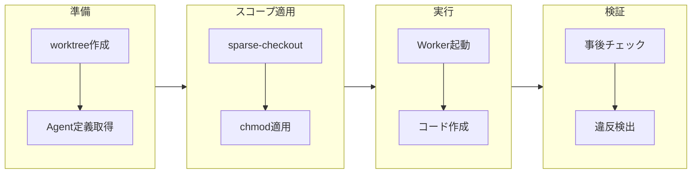

# スコープ制御

## 目的

Workerがアクセスできるファイルを物理的に制限し、AIの自動承認モードを安全に使用可能にする。本ドキュメントはスコープ制御のSSoT（Single Source of Truth）である。

## 背景

AIを自動承認モードで動作させると、すべてのファイル操作が無確認で実行される。これはスループット向上に有効だが、意図しないファイル変更のリスクがある。

**物理的制限を選ぶ理由:**
- 論理的制限（プロンプトで「.envを触るな」と指示）はAIが無視する可能性がある
- 物理的制限（ファイルが存在しない、書き込み不可）はAIが回避不可能
- 自動承認モードでもスコープ外への影響を防げる

## 設計原則

デフォルトで全ファイル読み取り可能。excludeで除外、writeで編集許可を明示的に制御する。

## スコープフィールド

| フィールド | 説明 | デフォルト値 | 物理的実装 |
|-----------|------|------------|-----------|
| exclude | アクセス不可 | 空（なし） | sparse-checkoutで除外（存在しない） |
| read | 参照可能 | すべて | worktreeに存在 |
| write | 編集可能 | 空（なし） | 明示的に指定されたファイルのみ |
| （暗黙） | read - write - exclude | - | chmod a-w で読み取り専用 |

### 優先順位と評価ロジック

| 優先順位 | 条件 | 結果 | 物理的状態 |
|----------|------|------|-----------|
| 1（最高） | excludeにマッチ | 除外 | ファイルが存在しない |
| 2 | readにマッチ && writeにマッチ | 編集可能 | 通常権限 |
| 3 | readにマッチ && writeに非マッチ | 読み取り専用 | chmod a-w |

**重要:** readを省略した場合、デフォルトでexcludeを除く全ファイルが参照可能になる。

## なぜスコープ制御が必要か

### 1. 意図しない変更の防止

| シナリオ | スコープ制御なし | スコープ制御あり |
|---------|----------------|----------------|
| タスク: ログイン機能実装 | Worker が.envを誤変更 → APIキー漏洩 | .envは存在しない → 変更不可能 |
| タスク: テスト追加 | Worker がproduction設定を変更 | production設定はread-only |

### 2. 自動承認モードの実現

| 運用モード | 動作 | スコープ制御の効果 |
|-----------|------|-------------------|
| 対話モード | 毎回人間が承認 | 不要だが安全 |
| 自動承認モード | すべて自動承認 | 物理的に制限されているため安全 |

**なぜ自動承認が重要か:** 対話モードでは人間のボトルネックが発生し、並列実行のメリットが薄れる。物理的制限により自動承認でも安全に運用できる。

### 3. 並列実行の安全性

| Worker | スコープ | 効果 |
|--------|---------|------|
| Worker A（認証API） | write: src/auth/ | auth配下のみ編集可能 |
| Worker B（決済API） | write: src/payment/ | payment配下のみ編集可能 |

互いのスコープが重ならないため、物理的に干渉不可能。

## 物理的実装

### Git Sparse Checkout（exclude）

**目的:** excludeにマッチするファイルを物理的に除外する。

| 手順 | 操作 | 効果 |
|------|------|------|
| 1 | sparse-checkout初期化 | cone modeで初期化 |
| 2 | excludeパターン設定 | 否定形で指定 |
| 3 | checkout実行 | 指定ファイルがworktreeから消える |

**効果:**
- Workerからファイルが見えない
- 編集しようとしてもファイルが存在しない
- AIがどのような手段を使ってもアクセス不可能

### chmod（read-only化）

**目的:** write対象外のファイルを読み取り専用にする。

| 対象 | 設定 | 効果 |
|------|------|------|
| writeにマッチ | 変更なし | 編集可能 |
| writeに非マッチ | chmod a-w | Permission Deniedで編集不可 |

**Windowsの場合:** chmodの代わりにattrib +Rを使用。完全な互換性はない。

## スコープ適用フロー

## Agent定義パターン

### 基本パターン（推奨）

| フィールド | 設定例 | 説明 |
|-----------|--------|------|
| exclude | **/*.env, **/secrets/**, **/.aws/**, **/node_modules/** | 機密情報・依存を除外 |
| read | （省略） | デフォルト: excludeを除く全ファイル |
| write | src/**, tests/**, package.json | 作業対象を明示的に指定 |

### 読み取り専用パターン（レビュアー用）

| フィールド | 設定例 | 説明 |
|-----------|--------|------|
| exclude | **/*.env, **/node_modules/** | 機密情報・依存を除外 |
| read | src/**, docs/**, README.md | 参照対象を明示的に限定 |
| write | （空配列） | 編集不可 |

## 事後チェック（検証）

スコープ制御は物理的制限だが、100%防げるわけではない。事後チェックで検証する。

### チェックロジック

| 手順 | 操作 | 判定 |
|------|------|------|
| 1 | git diffで変更ファイル一覧取得 | - |
| 2 | 各ファイルをexcludeと照合 | マッチ → 違反 |
| 3 | 各ファイルをwriteと照合 | 非マッチ → 違反 |
| 4 | 違反があれば | エラー記録、Orchestratorに通知 |

### 違反時の動作

| 条件 | セッションステータス | 後続処理 |
|------|---------------------|---------|
| スコープ違反検出 | failed | マージブロック |
| 違反なし | 次の検証へ | DoD検証に進む |

## セキュリティ考慮事項

### 攻撃ベクトルと対策

| 攻撃ベクトル | 物理的制限 | 事後チェック |
|-------------|-----------|-------------|
| chmod u+wで書き込み権限復元 | 防げない | 検出可能 |
| git sparse-checkout disable | 防げない | 検出可能 |
| 直接ファイル作成（echo > .env） | 防げない | 検出可能 |
| シンボリックリンクで迂回 | 防げない | 検出可能 |

### 多層防御

| レイヤー | 手法 | 効果 |
|---------|------|------|
| 1 | sparse-checkout + chmod | 誤操作・うっかりミスを防ぐ |
| 2 | 事後チェック（git diff） | 意図的な回避を検出 |
| 3 | DoD検証 | lint, test, buildで品質担保 |
| 4 | コードレビュー | 最終的な人間による確認 |

**設計意図:** レイヤー1は「AIが自然に守る」ことを目的とする。悪意ある回避はレイヤー2以降で検出する。

## worktree状態の例

### スコープ設定

| フィールド | 値 |
|-----------|-----|
| exclude | **/*.env, **/.aws/** |
| read | （デフォルト: すべて） |
| write | src/**, tests/**, package.json |

### 適用結果

| ファイル | 適用前 | 適用後 | 理由 |
|---------|--------|--------|------|
| .env | 存在 | 存在しない | exclude |
| .aws/credentials | 存在 | 存在しない | exclude |
| src/auth.ts | 存在 | 編集可能 | write |
| tests/auth.test.ts | 存在 | 編集可能 | write |
| docs/architecture.md | 存在 | 読み取り専用 | read - write |
| README.md | 存在 | 読み取り専用 | read - write |
| package.json | 存在 | 編集可能 | write |

## 制限事項

| 制限 | 説明 | 対策 |
|------|------|------|
| 絶対的な防御ではない | 物理的制限は誤操作防止が主目的 | 事後チェックで補完 |
| パフォーマンス影響 | 大規模リポジトリで遅くなる可能性 | 必要なファイルのみ対象にする |
| Windows互換性 | chmodの代わりにattrib使用 | 完全な互換性はない |

## よくある質問

| 質問 | 回答 |
|------|------|
| Workerがchmodで権限復元したら？ | 事後チェックで検出。write範囲外の変更はエラー記録 |
| sparse-checkout disableしたら？ | 同様に事後チェックで検出。exclude対象の変更は違反 |
| スコープを厳しくし過ぎると？ | 作業不可能になる。タスクに応じたAgent定義を用意する |
| readにもwriteにも含まれないファイルは？ | sparse-checkoutで除外。Workerは参照すらできない |

## 関連ドキュメント

- アーキテクチャ: @02-architecture/architecture.md
- Worker実行フロー: @07-runtime/worker-lifecycle.md
- Agent定義: @05-features/agent-system.md
- 用語集: @appendix/glossary.md
