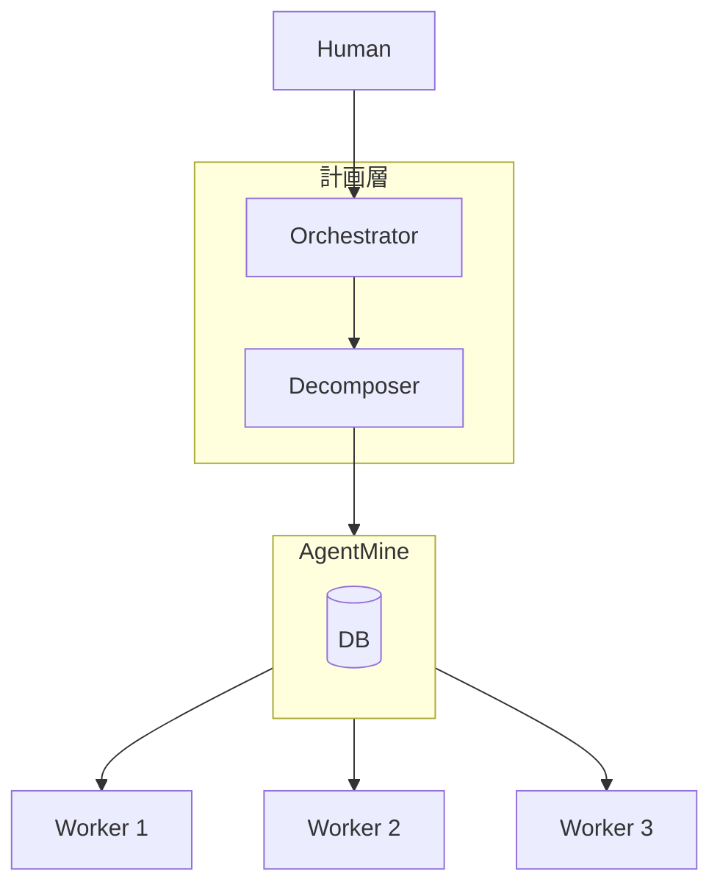
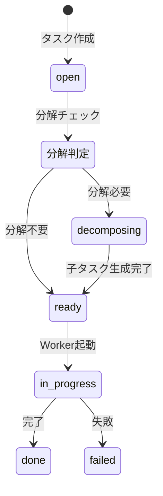

---
depends_on:
  - ./orchestrator-worker.md
  - ../04-data/data-model.md
tags: [core-concepts, task, decomposition, planning]
ai_summary: "大タスクを並列実行可能な粒度に分解する仕組みと、Decomposer役割の定義"
---

# タスク分解（Task Decomposition）

> Status: Draft
> 最終更新: 2026-01-28

本ドキュメントは、大きなタスクを並列実行可能な粒度に分解する仕組みを定義する。

---

## 背景

### 現状の課題

| 課題 | 説明 |
|------|------|
| 粒度の前提 | 現在のAgentMineは「タスクが既に適切な粒度で存在する」ことを前提としている |
| 手動分解の負担 | 「認証機能を実装して」のような大タスクを人間が手動で分解する必要がある |
| 並列化の障壁 | 分解されていないタスクは並列実行できない |

### 参考：multi-agent-shogun

multi-agent-shogunでは「家老」がタスク分解を担当する。AgentMineには相当する層がない。

---

## 提案アーキテクチャ

### 役割の拡張

### 役割定義

| 役割 | 責務 |
|------|------|
| Orchestrator | 全体計画、Decomposer起動判断、マージ判断 |
| **Decomposer（新）** | 大タスク→子タスク分解、依存関係分析 |
| Worker | コード実装（既存） |

---

## Decomposerの責務

### やること

| 責務 | 説明 |
|------|------|
| 分解判断 | タスクが分解すべきか判定する（complexity、見積もり時間に基づく） |
| 子タスク生成 | 並列実行可能な粒度にタスクを分割する |
| 依存関係設定 | 子タスク間の順序・依存を定義する |
| 粒度検証 | 「これ以上分解不要」の判定を行う |

### やらないこと

| 非責務 | 理由 |
|--------|------|
| Worker起動 | Orchestratorの仕事 |
| コード作成 | Workerの仕事 |
| マージ判断 | Orchestratorの仕事 |

---

## ステータス遷移

### 分解を含むフロー

### 新ステータス

| ステータス | 説明 |
|-----------|------|
| open | 初期状態 |
| **decomposing** | 分解処理中（Decomposer実行中） |
| **ready** | 分解完了、Worker起動可能 |
| in_progress | Worker実行中 |
| done | 完了 |
| failed | 失敗 |

---

## データモデル拡張

### tasksテーブル追加カラム

| カラム | 型 | 説明 |
|--------|-----|------|
| decomposition_status | enum | none, pending, in_progress, done |
| estimated_hours | float | 見積もり時間 |
| dependency_ids | json | 依存する子タスクID配列 |

---

## 分解判定基準

| 基準 | 閾値 | アクション |
|------|------|-----------|
| complexity | > 5 | 分解推奨 |
| estimated_hours | > 4h | 分解推奨 |
| 複数機能含む | - | 分解必須 |

---

## かんばん表示

### レーン構成

| レーン | 内容 |
|--------|------|
| Backlog | 未着手タスク |
| Decomposing | 分解処理中 |
| Ready | Worker起動可能 |
| In Progress | Worker実行中 |
| Done | 完了（PR作成済み） |

### 親子関係の表示

- 親タスクは折りたたみ可能
- 子タスクはインデント表示
- 依存関係は矢印で可視化

---

## 未決定事項

- Decomposerは専用Agentか、Orchestratorが兼任するか
- 分解の承認フローは必要か（自動 vs 人間確認）
- 依存関係のあるタスクの実行順制御
- 子タスクが全完了したら親タスクを自動でdoneにするか

---

## 関連ドキュメント

- [Orchestrator/Worker](./orchestrator-worker.md) - 既存の役割定義
- [データモデル](../04-data/data-model.md) - エンティティ定義
- [Worker実行フロー](../07-runtime/worker-lifecycle.md) - Worker実行の詳細
