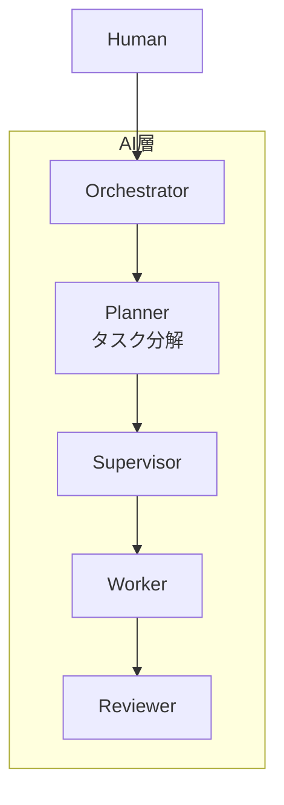
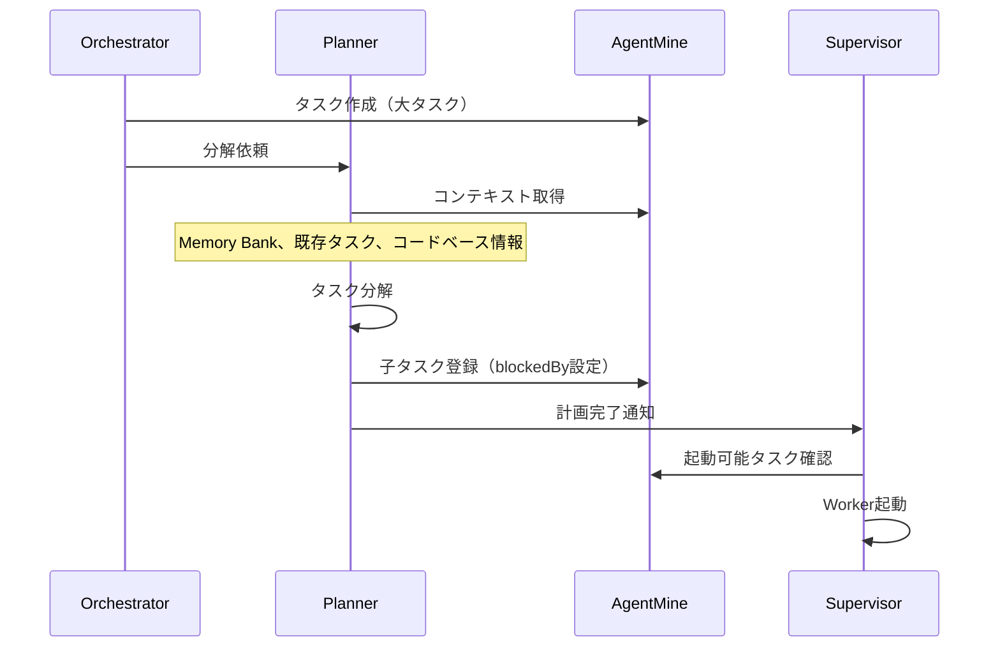
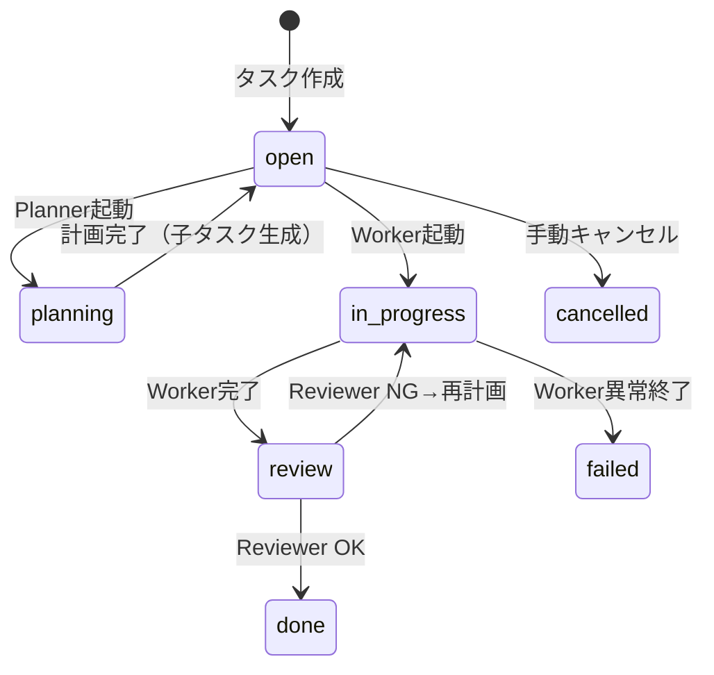
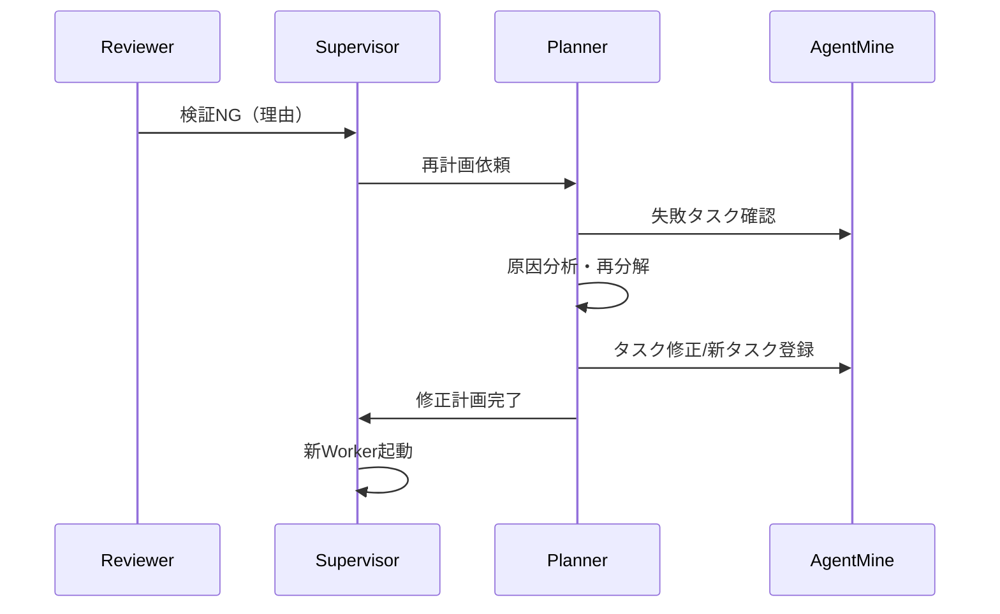

---
depends_on:
  - ./orchestrator-worker.md
  - ../04-data/data-model.md
  - ../10-decisions/007-five-layer-architecture.md
tags: [core-concepts, task, decomposition, planner]
ai_summary: "大タスクを並列実行可能な粒度に分解する仕組み。5層アーキテクチャのPlanner役割として定義"
---

# タスク分解（Task Decomposition）

> Status: Accepted
> 最終更新: 2026-01-29

本ドキュメントは、大きなタスクを並列実行可能な粒度に分解する仕組みを定義する。

---

## 背景

### 現状の課題

| 課題 | 説明 |
|------|------|
| 粒度の前提 | 現在のAgentMineは「タスクが既に適切な粒度で存在する」ことを前提としている |
| 手動分解の負担 | 「認証機能を実装して」のような大タスクを人間が手動で分解する必要がある |
| 並列化の障壁 | 分解されていないタスクは並列実行できない |

### 5層アーキテクチャとの関係

ADR-007で採用した5層アーキテクチャにおいて、タスク分解は**Planner**の責務として明確化された。



---

## Plannerの責務（タスク分解）

### やること

| 責務 | 説明 |
|------|------|
| 分解判断 | タスクが分解すべきか判定する（complexity、見積もり時間に基づく） |
| 子タスク生成 | 並列実行可能な粒度にタスクを分割する |
| 依存関係設定 | 子タスク間の順序・依存を`blockedBy`で定義する |
| 粒度検証 | 「これ以上分解不要」の判定を行う |
| 再計画 | Reviewer NGを受けてタスク定義を修正する |

### やらないこと

| 非責務 | 理由 |
|--------|------|
| Worker起動 | Supervisorの仕事 |
| コード作成 | Workerの仕事 |
| 進捗監視 | Supervisorの仕事 |
| 人間との対話 | Orchestratorの仕事 |

---

## 分解フロー

### 標準フロー



### 分解例

```
親タスク: 認証機能を実装 (id: 100)
├── 子1: DBスキーマ作成 (id: 101, blockedBy: [])
├── 子2: APIエンドポイント (id: 102, blockedBy: [101])
└── 子3: フロントUI (id: 103, blockedBy: [102])
```

---

## 分解判定基準

| 基準 | 閾値 | アクション |
|------|------|-----------|
| complexity | > 5 | 分解推奨 |
| estimated_hours | > 4h | 分解推奨 |
| 複数機能含む | - | 分解必須 |

---

## ステータス遷移

### 分解を含むフロー



### ステータス定義

| ステータス | 説明 |
|-----------|------|
| open | 初期状態、またはPlanner計画完了後 |
| planning | Planner実行中（分解処理中） |
| in_progress | Worker実行中 |
| review | Reviewer検証中 |
| done | 完了 |
| failed | 失敗 |
| cancelled | キャンセル |

---

## データモデル

### 依存関係の表現

ADR-006で定義された`blockedBy`カラムを使用する。

| カラム | 型 | 説明 |
|--------|-----|------|
| blockedBy | integer[] | このタスクをブロックしているタスクID配列 |
| parentId | integer | 親タスクID（分解元） |

### Plannerが登録する情報

| フィールド | 説明 |
|-----------|------|
| title | 子タスクのタイトル |
| description | 詳細な実装指示 |
| parentId | 親タスクID |
| blockedBy | 依存タスクID配列 |
| complexity | 複雑度（1-10） |
| type | タスクタイプ |

---

## NG時の対応

### NG責任の所在

| NG原因 | 責任者 | 対応 |
|--------|--------|------|
| タスク説明が曖昧 | Planner | 再分解 |
| 粒度が大きすぎ | Planner | 追加分解 |
| 依存関係ミス | Planner | 計画修正 |

**重要**: WorkerへのNG差し戻しは行わない。Workerは与えられた指示を実行するのみで、意図を挟む余地がない。問題は常に「指示側」であるPlannerにある。

### 再計画フロー



---

## 関連ドキュメント

- 5層アーキテクチャ: @03-core-concepts/orchestrator-worker.md
- ADR-007 5層アーキテクチャ: @10-decisions/007-five-layer-architecture.md
- データモデル: @04-data/data-model.md
- 依存関係モデル: @10-decisions/006-dependency-and-proposals.md
- Worker実行フロー: @07-runtime/worker-lifecycle.md
