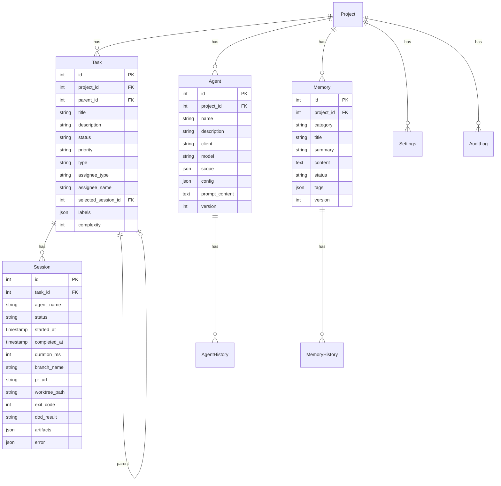
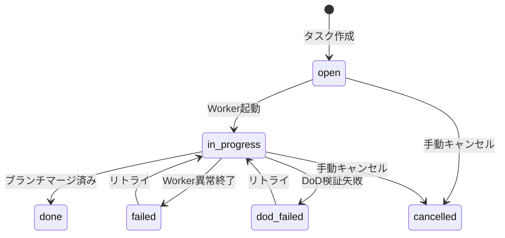
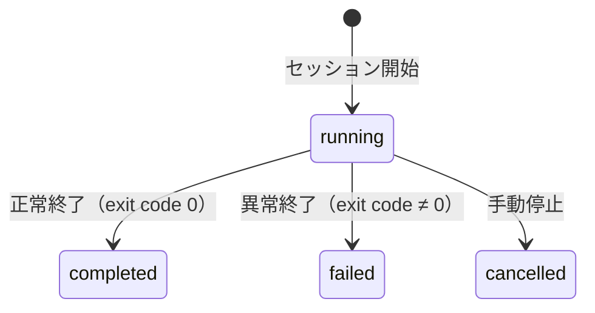

# データモデル

## 目的

AgentMineのデータ構造を定義する。本ドキュメントはデータモデルのSSoT（Single Source of Truth）である。

## 背景

AgentMineは「DBマスター」設計を採用する。すべてのデータはDBで管理し、ファイルは必要時にスナップショット出力する。

**なぜDBマスターか:**
- チーム全員が同じデータを参照できる（Single Source of Truth）
- リアルタイム協業が可能（Redmine的運用）
- YAMLファイル同期の複雑さを回避できる

## DB戦略

| 環境 | DB | 用途 | 理由 |
|------|-----|------|------|
| チーム開発（メイン） | PostgreSQL | 共有DB、リアルタイム協業 | 複数人での同時アクセス |
| 個人利用（サブ） | SQLite | お試し、オフライン | セットアップ不要 |

Drizzle ORMにより、両DBで共通のクエリAPIを使用する。

## ER図

## テーブル定義

### projects

| カラム | 型 | 説明 |
|--------|-----|------|
| id | integer PK | 自動採番 |
| name | text | プロジェクト名 |
| description | text | 説明 |
| created_at | timestamp | 作成日時 |
| updated_at | timestamp | 更新日時 |

### tasks

| カラム | 型 | 説明 |
|--------|-----|------|
| id | integer PK | 自動採番 |
| project_id | integer FK | プロジェクト参照 |
| parent_id | integer FK | 親タスク参照（階層構造） |
| title | text | タスクタイトル |
| description | text | 詳細説明 |
| status | enum | open, in_progress, done, failed, dod_failed, cancelled |
| priority | enum | low, medium, high, critical |
| type | enum | task, feature, bug, refactor |
| assignee_type | enum | ai, human |
| assignee_name | text | Agent名またはユーザー名 |
| selected_session_id | integer FK | 採用されたセッション |
| labels | json | 運用ラベル配列 |
| complexity | integer | 複雑度（1-10） |
| created_at | timestamp | 作成日時 |
| updated_at | timestamp | 更新日時 |

**設計意図:**
- assignee_typeでAIタスクと人間タスクを区別（Worker起動有無に影響）
- selected_session_idで並列比較の採用結果を記録
- labelsはstatusとは独立した運用用フィールド

### sessions

| カラム | 型 | 説明 |
|--------|-----|------|
| id | integer PK | 自動採番 |
| task_id | integer FK | タスク参照 |
| agent_name | text | 使用したAgent名 |
| status | enum | running, completed, failed, cancelled |
| started_at | timestamp | 開始日時 |
| completed_at | timestamp | 完了日時 |
| duration_ms | integer | 実行時間（ミリ秒） |
| session_group_id | text | 並列比較用グループID |
| idempotency_key | text | 冪等性キー |
| branch_name | text | ブランチ名 |
| pr_url | text | PR URL |
| worktree_path | text | worktreeパス |
| exit_code | integer | 終了コード（観測事実） |
| signal | text | 終了シグナル |
| dod_result | enum | passed, failed, skipped, timeout |
| artifacts | json | 成果物配列 |
| error | json | エラー情報 |

**設計意図:**
- exit_codeは観測可能な事実として記録（Workerが能動的に更新しない）
- dod_resultはAgentMineが自動検証した結果
- branchとprはセッションごとに管理（タスクではなく）

### agents

| カラム | 型 | 説明 |
|--------|-----|------|
| id | integer PK | 自動採番 |
| project_id | integer FK | プロジェクト参照 |
| name | text | Agent名（プロジェクト内一意） |
| description | text | 説明 |
| client | enum | claude-code, codex, aider, gemini-cli, opencode |
| model | text | モデル名 |
| scope | json | スコープ設定（read, write, exclude） |
| config | json | 追加設定（temperature等） |
| prompt_content | text | プロンプト内容 |
| dod | json | DoD検証コマンド配列 |
| version | integer | バージョン番号 |
| created_by | text | 作成者 |
| created_at | timestamp | 作成日時 |
| updated_at | timestamp | 更新日時 |

**設計意図:**
- scopeはJSON形式でread/write/excludeパターンを保持
- dodはAgent単位でデフォルト定義（タスクで上書き可能）
- versionで変更履歴管理

### memories

| カラム | 型 | 説明 |
|--------|-----|------|
| id | integer PK | 自動採番 |
| project_id | integer FK | プロジェクト参照 |
| category | text | カテゴリ（フォルダ相当） |
| title | text | タイトル |
| summary | text | 要約（プロンプト注入用） |
| content | text | Markdown本文 |
| status | enum | draft, active, archived |
| tags | json | タグ配列 |
| related_task_id | integer FK | 関連タスク参照 |
| version | integer | バージョン番号 |
| created_by | text | 作成者 |
| created_at | timestamp | 作成日時 |
| updated_at | timestamp | 更新日時 |

**設計意図:**
- statusがactiveのMemoryのみWorkerに出力
- summaryはトークン節約のためプロンプトに要約を注入、詳細はWorkerが必要時に参照

### settings

| カラム | 型 | 説明 |
|--------|-----|------|
| id | integer PK | 自動採番 |
| project_id | integer FK | プロジェクト参照 |
| key | text | 設定キー（プロジェクト内一意） |
| value | json | 設定値 |
| updated_by | text | 更新者 |
| updated_at | timestamp | 更新日時 |

**設定キー例:**
- git.baseBranch: ベースブランチ名
- execution.maxWorkers: 最大並列Worker数
- labels.default: デフォルトラベル定義

### audit_logs

| カラム | 型 | 説明 |
|--------|-----|------|
| id | integer PK | 自動採番 |
| project_id | integer FK | プロジェクト参照 |
| user_id | text | 操作者（人間 or AI識別子） |
| action | enum | create, update, delete, start, stop, export |
| entity_type | enum | task, agent, memory, session, settings |
| entity_id | text | 対象エンティティID |
| changes | json | 変更内容（before/after） |
| created_at | timestamp | 作成日時 |

### 履歴テーブル（agent_history, memory_history）

| カラム | 型 | 説明 |
|--------|-----|------|
| id | integer PK | 自動採番 |
| {entity}_id | integer FK | 親エンティティ参照 |
| snapshot | json | 変更前のスナップショット |
| version | integer | バージョン番号 |
| changed_by | text | 変更者 |
| changed_at | timestamp | 変更日時 |
| change_summary | text | 変更内容の要約 |

## ステータス遷移

### タスクステータス

### ステータス判定ロジック

タスクステータスは観測可能な事実から自動判定する。

| 条件 | ステータス | 備考 |
|------|-----------|------|
| セッションなし | open | 初期状態 |
| runningセッションが存在 | in_progress | 並列実行中も含む |
| dodResult=passedかつブランチマージ済み | done | 採用済み |
| dodResult=failed | dod_failed | DoD検証失敗 |
| 全セッションが失敗/取消 | failed | リトライ可能 |
| 手動キャンセル | cancelled | 明示操作 |

**Git判定の仕組み:**
セッションブランチがベースブランチにマージ済みかどうかをgit logで判定する。GitHub/GitLab/Bitbucket等のプラットフォームに依存しない。

### AIタスク vs 人間タスク

| 項目 | AIタスク | 人間タスク |
|------|---------|-----------|
| Worker起動 | あり | なし |
| worktree隔離 | あり | なし（通常のリポジトリで作業） |
| スコープ制御 | あり | なし |
| 完了判定 | Git判定 | Git判定 |
| failed発生 | 全セッション失敗時 | 手動設定のみ |

### セッションステータス

## インデックス設計

| テーブル | インデックス | 目的 |
|---------|------------|------|
| tasks | status | ステータス別一覧取得 |
| tasks | assignee_type, assignee_name | 担当者別一覧取得 |
| tasks | project_id | プロジェクト別一覧取得 |
| tasks | parent_id | 子タスク取得 |
| sessions | task_id | タスク別セッション取得 |
| sessions | status | ステータス別一覧取得 |
| sessions | idempotency_key | 冪等性チェック（UNIQUE） |
| agents | project_id, name | Agent名検索（UNIQUE） |
| memories | category | カテゴリ別一覧取得 |
| settings | project_id, key | 設定キー検索（UNIQUE） |
| audit_logs | entity_type, entity_id | エンティティ別履歴取得 |
| audit_logs | created_at | 時系列取得 |

## Worker用ファイル出力

Worker実行時、DBからworktreeへスナップショット出力する。

| 出力先 | 内容 | 権限 |
|--------|------|------|
| .agentmine/memory/{category}/{id}.md | status=activeのMemory | read-only |
| .claude/CLAUDE.md | プロンプト（claude-code用） | read-only |
| .agentmine/prompt.md | プロンプト（汎用） | read-only |

**出力フロー:**
1. DBからstatus=activeのMemoryを取得
2. worktreeに.agentmine/memory/として出力
3. プロンプトをAIクライアント設定ファイルへ出力
4. 完了後は設定に応じて削除または保持

## PostgreSQL拡張（将来）

PostgreSQL環境では、pgvectorを使用したベクトル検索が利用可能。

| 機能 | 説明 |
|------|------|
| embeddingカラム | Memory内容のベクトル埋め込み |
| セマンティック検索 | 類似Memoryの検索 |
| 関連コンテキスト自動取得 | タスク内容から関連Memoryを自動選択 |

## マイグレーション・エクスポート

### CLIコマンド

| コマンド | 説明 |
|---------|------|
| agentmine db migrate:generate | マイグレーション生成 |
| agentmine db migrate | マイグレーション実行 |
| agentmine db migrate:rollback | ロールバック |
| agentmine db import --from .agentmine/ | 既存YAMLからインポート |
| agentmine export --output ./backup/ | 全データエクスポート |

### エクスポート形式

| 対象 | 出力形式 | 用途 |
|------|---------|------|
| agents | YAML | 設定共有、バックアップ |
| memories | Markdown | ドキュメント共有 |
| settings | YAML | 設定共有 |

## 関連ドキュメント

- アーキテクチャ: @02-architecture/architecture.md
- スコープ制御: @03-core-concepts/scope-control.md
- Worker実行フロー: @07-runtime/worker-lifecycle.md
- 用語集: @appendix/glossary.md
