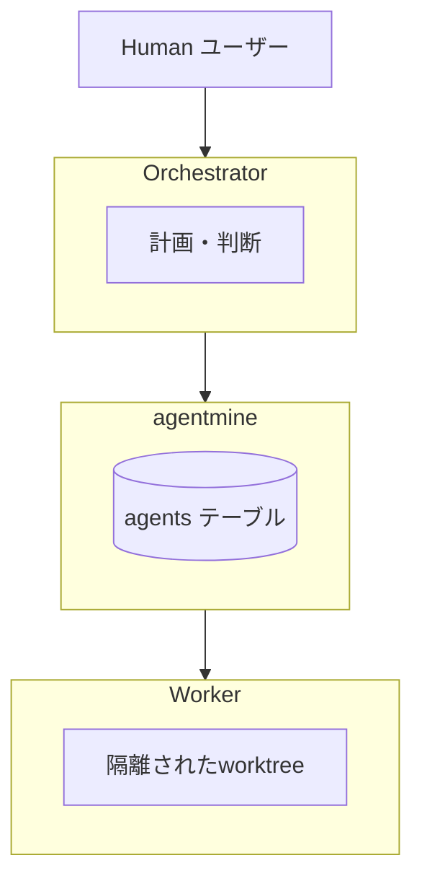
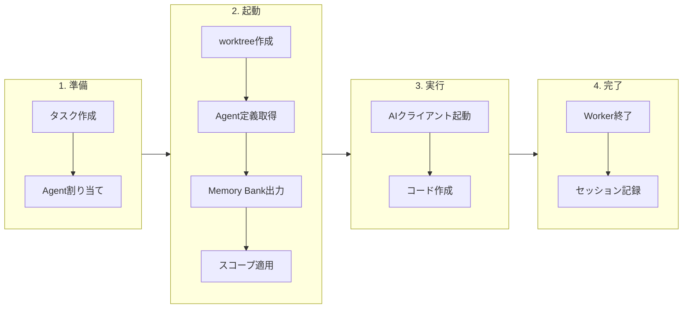

# Agent System

## 目的

役割別エージェント定義・実行システムを提供する。本ドキュメントはAgent SystemのSSoT（Single Source of Truth）である。

## 背景

並列AI開発では、異なる役割（設計、実装、レビュー）を持つ複数のWorkerが必要。各Workerに適切な能力・制約を設定することで、安全で効率的な開発が可能になる。

**なぜDBマスターか:**
- チーム全員が同じエージェント定義を参照できる
- リアルタイムで共有・編集可能
- 変更履歴をDB内で追跡できる

## 設計原則

エージェント定義はDBで管理。Worker起動時に必要なファイルをworktreeへ出力する。

## Orchestrator/Workerモデル

| 役割 | 説明 | 例 |
|------|------|-----|
| Orchestrator | ユーザーと会話し、タスクを割り振るAI | Claude Code本体 |
| Worker | 実際にタスクを実行するAI | Taskサブエージェント |
| Agent定義 | Workerの能力・制約を定義したもの | DBに保存 |

## agentsテーブル

| カラム | 型 | 説明 |
|--------|-----|------|
| id | integer PK | 自動採番 |
| project_id | integer FK | プロジェクト参照 |
| name | text | Agent名（プロジェクト内一意） |
| description | text | 説明 |
| client | text | AIクライアント（claude-code, codex等） |
| model | text | モデル名（opus, sonnet等） |
| scope | json | スコープ設定（read, write, exclude） |
| config | json | 追加設定（temperature等） |
| prompt_content | text | プロンプト内容（Markdown） |
| version | integer | バージョン番号 |
| created_by | text | 作成者 |
| created_at | timestamp | 作成日時 |
| updated_at | timestamp | 更新日時 |

## エージェント定義

### 基本構造

| フィールド | 説明 | 例 |
|-----------|------|-----|
| name | Agent名 | coder |
| description | 説明 | コード実装担当 |
| client | AIクライアント | claude-code |
| model | AIモデル | sonnet |
| scope.read | 参照可能 | **/* |
| scope.write | 編集可能 | src/**, tests/** |
| scope.exclude | アクセス不可 | **/*.env |
| config.temperature | 温度 | 0.3 |
| promptContent | プロンプト | Markdown形式 |

### 組み込みエージェント

`agentmine init` 実行時にDBに作成される初期エージェント。

| 名前 | 役割 | モデル | write | 特徴 |
|------|------|--------|-------|------|
| planner | 設計・計画・見積もり | opus | 空（読み取り専用） | 高品質な分析 |
| coder | コード実装 | sonnet | src/**, tests/** | バランス型 |
| reviewer | コードレビュー | haiku | 空（読み取り専用） | 高速・低コスト |
| writer | ドキュメント作成 | sonnet | docs/**, *.md | 文書特化 |

### スコープ設定

| フィールド | 説明 | 物理的実装 |
|-----------|------|-----------|
| read | 参照可能なファイル | worktreeに存在 |
| write | 編集可能なファイル | 通常権限 |
| exclude | アクセス不可 | sparse-checkoutで除外 |

**スコープ優先順位:** exclude → read → write

## プロンプト管理

### promptContentフィールド

プロンプトはMarkdownで保存。以下の内容を含む。

| セクション | 内容 |
|-----------|------|
| あなたの役割 | Workerの責務を説明 |
| 作業フロー | 推奨する作業手順 |
| コーディング規約 | 守るべきルール |
| 禁止事項 | やってはいけないこと |

### Worker起動時の展開

| 出力先 | 内容 |
|--------|------|
| .agentmine/memory/ | DBからMemory Bankスナップショット |
| AIに直接渡す | Agent定義 + プロンプト |

## 実行フロー

## CLI

| コマンド | 説明 |
|---------|------|
| agentmine agent list | エージェント一覧 |
| agentmine agent show coder | エージェント詳細 |
| agentmine agent create --name security-auditor | 作成 |
| agentmine agent update coder --model opus | 更新 |
| agentmine agent edit coder --prompt | プロンプト編集 |
| agentmine agent delete security-auditor | 削除 |
| agentmine agent history coder | 履歴表示 |
| agentmine agent rollback coder --version 3 | 過去バージョンに戻す |
| agentmine agent export coder --output ./coder.yaml | エクスポート |
| agentmine agent import --file ./coder.yaml | インポート |

## カスタムエージェント例

### セキュリティ監査担当

| 項目 | 値 |
|------|-----|
| name | security-auditor |
| description | セキュリティ監査担当（読み取り専用） |
| client | claude-code |
| model | opus |
| write | 空（読み取り専用） |
| temperature | 0.2 |

### フロントエンド専門

| 項目 | 値 |
|------|-----|
| name | frontend-coder |
| description | フロントエンド実装担当 |
| client | claude-code |
| model | sonnet |
| write | src/components/**, src/pages/**, src/styles/** |

### 別クライアント使用

| 項目 | 値 |
|------|-----|
| name | fast-coder |
| description | 高速実装担当 |
| client | codex |
| model | gpt-4.1 |
| write | src/**, tests/** |

## 関連ドキュメント

- スコープ制御: @03-core-concepts/scope-control.md
- Worker実行フロー: @07-runtime/worker-lifecycle.md
- データモデル: @04-data/data-model.md
- 用語集: @appendix/glossary.md
