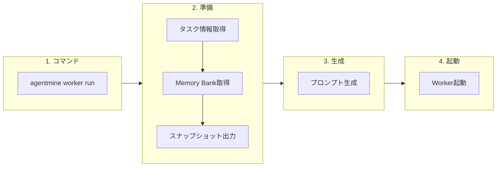

# Memory Bank

## 目的

プロジェクト決定事項を永続化し、AIエージェントに知識として渡す。本ドキュメントはMemory BankのSSoT（Single Source of Truth）である。

## 背景

AIエージェントはセッション終了時に全てを忘れる。「DBはPostgreSQL」「認証はJWT」などの決定事項が失われると、毎回同じ質問や判断が発生する。

**なぜMemory Bankか:**
- 決定事項の永続化により一貫性を保てる
- 次回セッション開始時に自動で参照情報を渡せる
- 人間も確認・編集可能（Markdown形式）

## 設計原則

DBがマスター。ファイルはスナップショット/エクスポート用のみ。`.agentmine/`はデフォルトでgitignore。

## memoriesテーブル

| カラム | 型 | 説明 |
|--------|-----|------|
| id | integer PK | 自動採番 |
| project_id | integer FK | プロジェクト参照 |
| category | text | カテゴリ（フォルダ相当） |
| title | text | タイトル |
| summary | text | 要約（プロンプト注入用） |
| content | text | Markdown本文 |
| status | enum | draft, active, archived |
| tags | json | タグ配列 |
| related_task_id | integer FK | 関連タスク参照 |
| version | integer | バージョン番号 |
| created_by | text | 作成者 |
| created_at | timestamp | 作成日時 |
| updated_at | timestamp | 更新日時 |

## カテゴリ

| カテゴリ | 説明 | 例 |
|---------|------|-----|
| architecture | アーキテクチャ決定 | DB、フレームワーク、API設計 |
| tooling | ツール選定 | テスト、リンター、ビルドツール |
| convention | 規約 | コーディングスタイル、命名規則 |
| rule | ルール | 必須事項、禁止事項 |

**カテゴリはプロジェクト設定で拡張可能。**

## ステータス

| ステータス | 説明 | Worker注入 |
|-----------|------|-----------|
| draft | 下書き | しない |
| active | 有効 | する |
| archived | アーカイブ | しない |

## スナップショット出力

Worker起動時やエクスポート時に、DBからスナップショットを生成する。

| 出力先 | 内容 |
|--------|------|
| .agentmine/memory/{category}/{id}.md | 各Memory |

**ファイル名:** memory.idを使用（例: 1.md, 2.md）

## コンテキスト注入

### 注入タイミング

### 生成されるコンテキスト

| セクション | 内容 |
|-----------|------|
| Memory Bank Summary | activeなMemoryの要約（箇条書き） |
| Project Context | 参照可能なファイル一覧 |
| タスク | タスクのタイトルと説明 |

**注入対象:** status=activeのみ。要約は10項目以内の簡潔な箇条書きを推奨。

## CLI

| コマンド | 説明 |
|---------|------|
| agentmine memory list | 決定事項一覧 |
| agentmine memory list --category architecture | カテゴリ別 |
| agentmine memory list --status active | ステータス別 |
| agentmine memory add --category tooling --title "テストフレームワーク" | 追加 |
| agentmine memory edit {id} | 編集 |
| agentmine memory remove {id} | 削除 |
| agentmine memory preview | コンテキストプレビュー |
| agentmine memory export --output ./memory/ | エクスポート |
| agentmine memory import --dir ./memory/ | インポート |

## Git連携

DBがマスター。必要時にスナップショットをエクスポートしてGit管理する。

| 操作 | コマンド |
|------|---------|
| エクスポート | agentmine memory export --output ./memory/ |
| 差分確認 | git diff ./memory/ |
| 履歴確認 | git log --oneline ./memory/ |

## メリット・デメリット

### メリット

| メリット | 説明 |
|---------|------|
| 決定事項の永続化 | プロジェクトの「なぜ」を記録 |
| 自動注入 | Worker起動時に自動で渡される |
| 人間可読 | Markdownで確認・編集可能 |
| 一貫性 | DBを単一の真実源にして同期問題を回避 |

### デメリット

| デメリット | 対策 |
|-----------|------|
| DB必須 | SQLiteでゼロ設定対応 |
| Git Diff不可視 | 必要時にエクスポート |

## 関連ドキュメント

- DBマスター方式: @03-core-concepts/db-master.md
- データモデル: @04-data/data-model.md
- Worker実行フロー: @07-runtime/worker-lifecycle.md
- セッションログ: @05-features/session-log.md
- 用語集: @appendix/glossary.md
