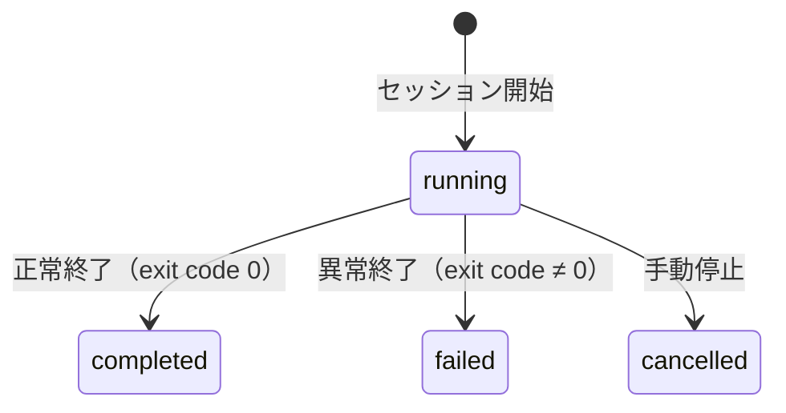

# Session Log

## 目的

Worker実行の記録と監査を提供する。本ドキュメントはSession LogのSSoT（Single Source of Truth）である。

## 背景

並列AI開発では、いつ・誰が・何をしたかの記録が重要。デバッグ、監査、振り返りのためにセッション情報を永続化する。

**Memory Bank vs Session Log:**

| 項目 | Memory Bank | Session Log |
|------|-------------|-------------|
| 目的 | プロジェクト決定事項 | 実行履歴 |
| 性質 | 永続的な知識 | 監査・デバッグ用 |
| 内容 | 覚えておくべきこと | 何が起きたか |

## 設計原則

Orchestratorが観測可能な範囲のみ記録。Worker内部（トークン使用量、ツール呼び出し）は記録しない。

## 記録項目

| 項目 | 説明 |
|------|------|
| session_id | セッション識別子 |
| task_id | 紐づくタスク（1 task = N sessions） |
| agent_name | 使用エージェント |
| started_at | 開始時刻 |
| completed_at | 終了時刻 |
| duration_ms | 実行時間（ミリ秒） |
| session_group_id | 並列比較用グループID |
| idempotency_key | 重複開始防止キー |
| branch_name | セッションのブランチ名 |
| pr_url | セッションのPR URL |
| worktree_path | worktreeパス |
| status | running / completed / failed / cancelled |
| exit_code | Workerプロセスの終了コード |
| signal | 終了シグナル（SIGTERM等） |
| dod_result | DoD結果: pending / merged / timeout / error |
| artifacts | 成果物一覧（変更ファイル） |
| error | エラー情報（失敗時） |

## sessionsテーブル

| カラム | 型 | 説明 |
|--------|-----|------|
| id | integer PK | 自動採番 |
| task_id | integer FK | タスク参照 |
| agent_name | text | 使用Agent名 |
| status | enum | running, completed, failed, cancelled |
| started_at | timestamp | 開始日時 |
| completed_at | timestamp | 完了日時 |
| duration_ms | integer | 実行時間 |
| session_group_id | text | 並列比較用 |
| idempotency_key | text | 冪等性キー |
| branch_name | text | ブランチ名 |
| pr_url | text | PR URL |
| worktree_path | text | worktreeパス |
| exit_code | integer | 終了コード |
| signal | text | 終了シグナル |
| dod_result | enum | pending, merged, timeout, error |
| artifacts | json | 成果物配列 |
| error | json | エラー情報 |

## ステータス遷移

## 保持期間

| 設定 | デフォルト | 説明 |
|------|-----------|------|
| enabled | false | 自動削除の有効/無効 |
| days | 90 | 保持日数（有効時） |

**方針:** 各プロジェクトの設定に委ねる。AgentMineでデフォルトは決めない。

## 用途

| 用途 | 対象者 | 見たい情報 |
|------|--------|-----------|
| デバッグ | 開発者 | 失敗したセッションの詳細、エラー内容 |
| 監査 | 管理者 | いつ誰が何をしたか |
| 振り返り | チーム | タスクの実行履歴 |
| コスト把握 | Orchestrator | 実行時間の傾向 |

## CLI

| コマンド | 説明 |
|---------|------|
| agentmine session list | セッション一覧 |
| agentmine session list --task 42 | タスク別 |
| agentmine session list --status failed | ステータス別 |
| agentmine session show 123 | セッション詳細 |
| agentmine session cleanup --days 90 | 古いセッション削除 |

## 責務分担

| 役割 | 責務 |
|------|------|
| AgentMine | セッション情報の永続化（sessionsテーブル） |
| AgentMine | セッション一覧・詳細の提供（CLI, MCP, Web UI） |
| AgentMine | 古いセッションの自動クリーンアップ（設定時） |
| Orchestrator | 通常は agentmine worker run で開始 |
| Orchestrator | agentmine worker done で終了・クリーンアップ |
| Orchestrator | 詳細記録が必要なら session end で追記 |

## 関連ドキュメント

- Worker実行フロー: @07-runtime/worker-lifecycle.md
- Observable Facts: @03-core-concepts/observable-facts.md
- Memory Bank: @05-features/memory-bank.md
- エラーハンドリング: @05-features/error-handling.md
- 用語集: @appendix/glossary.md
