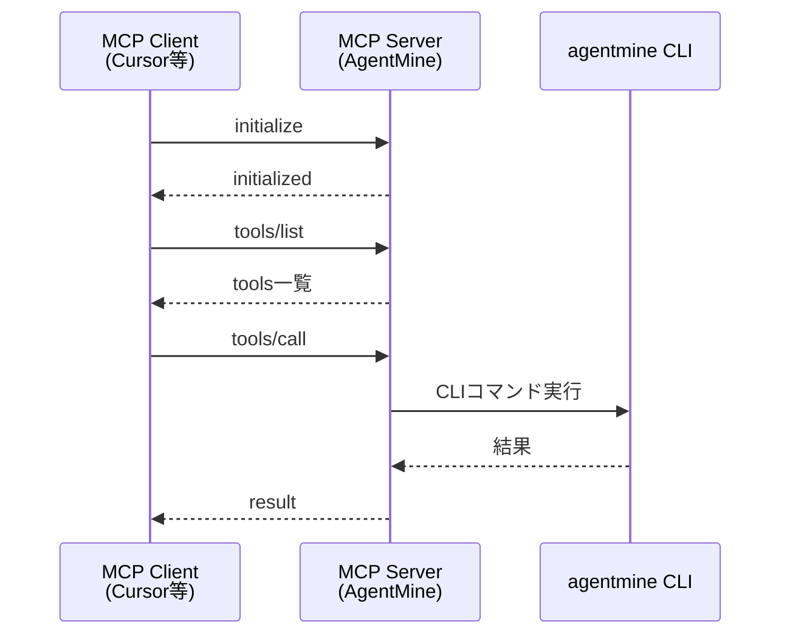

# MCP設計

## 目的

Model Context Protocol (MCP) によるエディタ連携を提供する。本ドキュメントはMCP設計のSSoT（Single Source of Truth）である。

## 背景

Cursor、Windsurf、Claude Desktop等のMCP対応クライアントからAgentMineを操作可能にする。OrchestratorがエディタからWorkerを起動できる。

**なぜCLIラッパーか:**
- CLIとMCPで二重実装を避ける
- CLIのexit codeとエラー処理を統一
- 現在の主流はSkills/CLIベースの操作

## 設計原則

MCPは独自実装ではなく、CLIコマンドのラッパーとして動作する。

## 通信フロー

## 設定

### クライアント設定

| 項目 | 値 |
|------|-----|
| command | AgentMine |
| args | ["mcp", "serve"] |
| cwd | /path/to/project |

### サーバー起動

| コマンド | 説明 |
|---------|------|
| agentmine mcp serve | stdio通信（デフォルト） |
| agentmine mcp serve --verbose | デバッグモード |

## MCP Tools

### タスク管理

| ツール | 説明 | CLIラッパー |
|--------|------|------------|
| task_list | タスク一覧取得 | task list --json |
| task_get | タスク詳細取得 | task show {id} --json |
| task_create | タスク作成 | task add ... |
| task_update | タスク更新 | task update {id} ... |

### task_listパラメータ

| パラメータ | 型 | 説明 |
|-----------|-----|------|
| status | string | フィルタ: open / in_progress / done / failed / cancelled |
| assignee | string | 担当者でフィルタ |
| limit | number | 最大件数（デフォルト: 20） |

### task_createパラメータ

| パラメータ | 型 | 必須 | 説明 |
|-----------|-----|------|------|
| title | string | ✓ | タスクタイトル |
| description | string | | 説明 |
| priority | string | | low / medium / high / critical |
| type | string | | task / feature / bug / refactor |
| assignee | string | | 担当者名 |
| assigneeType | string | | ai / human |

### Worker起動

| ツール | 説明 | CLIラッパー |
|--------|------|------------|
| worker_command | Worker起動コマンド生成 | worker run {taskId} |

### worker_commandパラメータ

| パラメータ | 型 | 必須 | 説明 |
|-----------|-----|------|------|
| taskId | number | ✓ | タスクID |
| agent | string | | エージェント名 |
| client | string | | AIクライアント（claude-code / codex / gemini-cli） |
| auto | boolean | | 自動承認フラグ |

### worker_commandレスポンス

| フィールド | 説明 |
|-----------|------|
| command | 実行コマンド |
| client | AIクライアント |
| worktree | worktreeパス |
| sessionId | セッションID |
| agent | エージェント名 |
| task | タスク情報（id, title, branch） |

### セッション管理

| ツール | 説明 | CLIラッパー |
|--------|------|------------|
| session_start | セッション開始 | session start {taskId} |
| session_end | セッション終了 | session end {id} --exit-code ... |
| session_list | セッション一覧 | session list --json |

### session_endパラメータ

| パラメータ | 型 | 必須 | 説明 |
|-----------|-----|------|------|
| sessionId | number | ✓ | セッションID |
| exitCode | number | ✓ | 終了コード |
| signal | string | | 終了シグナル |
| dodResult | string | | DoD結果: pending / merged / timeout / error |
| artifacts | array | | 成果物一覧 |
| error | object | | エラー情報 |

### エージェント定義

| ツール | 説明 | CLIラッパー |
|--------|------|------------|
| agent_list | エージェント一覧 | agent list --json |
| agent_get | エージェント詳細 | agent show {name} --json |

### Memory Bank

| ツール | 説明 | CLIラッパー |
|--------|------|------------|
| memory_list | 決定事項一覧 | memory list --json |
| memory_add | 決定事項追加 | memory add ... |
| memory_preview | コンテキストプレビュー | memory preview |

### memory_addパラメータ

| パラメータ | 型 | 必須 | 説明 |
|-----------|-----|------|------|
| id | string | ✓ | ID（slug） |
| category | string | ✓ | カテゴリ |
| title | string | ✓ | タイトル |
| summary | string | | 要約 |
| status | string | | draft / active / archived |
| content | string | | 本文 |

## MCP Resources

| URI | 名前 | 説明 | MIME |
|-----|------|------|------|
| project://memory | Memory Bank | Memory Bank内容 | text/markdown |
| task://{id} | Task #{id} | タスク詳細 | application/json |
| agent://{name} | Agent: {name} | エージェント定義 | application/yaml |

## エラーハンドリング

### MCPエラーコード

| MCPコード | CLIコード | 意味 |
|-----------|----------|------|
| -32001 | 5 | TaskNotFound |
| -32002 | 5 | AgentNotFound |
| -32003 | 5 | SessionNotFound |
| -32004 | 6 | InvalidStatus |
| -32005 | 6 | SessionAlreadyRunning |
| -32006 | 3 | ConfigError |
| -32007 | 2 | ValidationError |
| -32008 | 5 | GitError |

## 使用例

### 並列実行準備

| 手順 | MCP Tool | 説明 |
|------|---------|------|
| 1 | task_list status="open" | オープンタスク取得 |
| 2 | worker_command taskId=3 | Worker起動コマンド生成 |
| 3 | (外部) | Orchestratorがサブプロセスで起動 |

### Memory Bank参照

| 手順 | MCP Tool | 説明 |
|------|---------|------|
| 1 | memory_list | 決定事項一覧取得 |
| 2 | memory_add id="linter" category="tooling" | 決定事項追加 |
| 3 | memory_preview | コンテキストプレビュー |

## 関連ドキュメント

- CLI設計: @06-interfaces/cli/overview.md
- Memory Bank: @05-features/memory-bank.md
- Worker実行フロー: @07-runtime/worker-lifecycle.md
- 用語集: @appendix/glossary.md
