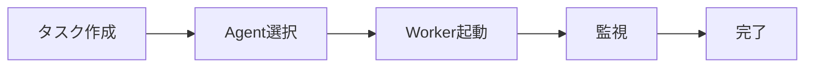

# Web UI

## 目的

人間がAIエージェント（Worker）を管理・監視するためのインターフェースを提供する。CLIを使わずに全操作を完結できることを目指す。

## 背景

AgentMineはOrchestrator/Workerモデルを採用しており、OrchestratorはAI（CLI/MCP経由）と人間（Web UI経由）の両方が担うことができる。人間がOrchestratorとして機能するためには、CLIを使わずにすべての操作を完結できるインターフェースが必要。

**なぜCLI不要を目指すか:**
- 人間はGUIの方が直感的に操作できる
- AIはCLI/MCPの方が効率的（スクリプト化、自動化）
- 両者が同じデータを見られることが協業の前提

## 設計原則

| 原則 | 説明 | 理由 |
|------|------|------|
| Web UI完結 | CLIなしで全操作可能 | 人間のOrchestratorをサポート |
| キーボードファースト | マウス不要で操作可能 | 開発者の効率性 |
| デュアルエディタ | UI形式 + YAML/Markdown直編集 | 初心者と上級者両方をサポート |
| リアルタイム | セッション状態の即座な反映 | Worker監視に必須 |
| ダークモード | 開発者向けに必須 | 目の疲れ軽減 |

## 画面構成

| 画面 | 読み取り | 編集 | 説明 |
|------|:--------:|:----:|------|
| Dashboard | O | - | 統計・概要・クイックアクセス |
| Tasks | O | O | タスクCRUD、複数ビュー |
| Sessions | O | O | 実行監視、開始・キャンセル |
| Agents | O | O | UI編集 + YAML直編集 |
| Memory Bank | O | O | Markdownエディタ内蔵 |
| Settings | O | O | UI編集 + YAML直編集 |

## アクターモデル（人間とAIの統合管理）

タスクの担当者として、人間とAgentを「アクター」として統一的に扱う。

**なぜ統合管理か:**
- 人間のタスクもAIのタスクも同一画面で管理できる
- 担当者選択時に人間もAgentも同列に表示される
- 個人利用（自分 + 複数Agent）から組織利用（チームメンバー + Agent群）まで自然にスケール

| アクター種別 | ステータス管理 | 例 |
|-------------|---------------|-----|
| human | 手動更新 | 井口さん、田中さん |
| agent | 事実ベース自動判定 | coder、reviewer |

## Board View（軸切り替え対応）

タスクをKanban形式で表示する際、複数の軸で切り替え可能。

**なぜ軸切り替えが必要か:**
- AIタスクのstatusは観測事実から自動判定されるため、ドラッグで変更できない
- statusをカラムにしたBoardは「見るだけ」になり、AIタスクには使いにくい
- 代わりにlabel/priority/assigneeをカラムにすれば、ドラッグで変更可能

| 軸 | カラム例 | ドラッグ操作 |
|----|---------|-------------|
| status | open, in_progress, done | 人間タスクのみ変更可能 |
| label | blocked, needs_review, ready | 全タスク変更可能 |
| priority | critical, high, medium, low | 全タスク変更可能 |
| assignee | coder, reviewer, 井口さん | 全タスク変更可能 |

**デフォルトラベル:**
- blocked（ブロック中）
- needs_review（レビュー待ち）
- ready（着手可能）
- candidate（候補）
- on_hold（保留）

## エディタシステム（VSCode級品質）

### なぜ高品位なエディタが必要か

AIのプロンプトや設定を編集する以上、ミスが致命的な結果を招く可能性がある。

**具体的なユースケース:**
- プロンプトの長文作成（数百行になることもある）
- 複数YAMLファイルの編集（Agent定義、設定など）
- スコープパターンの記述（globパターンのミスは危険）

**エラーを発見しやすくするための要件:**
- リアルタイムの構文検証
- スキーマベースの入力補完
- フォーマットの自動整形

### 編集対象と検証要件

| 対象 | 形式 | スキーマ検証 | カスタムLint | フォーマット |
|------|------|:------------:|:------------:|:------------:|
| Agent定義 | YAML | O | - | O |
| Config | YAML | O | - | O |
| Prompts | Markdown | - | O（テンプレート変数） | O |
| Memory Bank | Markdown | - | O（構造検証） | O |

### Monaco Editor採用理由

| 選択肢 | 評価 | 理由 |
|--------|------|------|
| Monaco Editor | 採用 | VSCodeと同じエンジン、JSON Schema対応、IntelliSense |
| CodeMirror | 不採用 | 軽量だがスキーマ検証が弱い |
| Ace Editor | 不採用 | 古いアーキテクチャ |

### エディタ機能要件

| 機能 | 実装方法 |
|------|---------|
| JSON Schemaによるリアルタイム検証 | monaco-yaml統合 |
| IntelliSense（補完・ホバー情報） | カスタムCompletionProvider |
| 入力中のエラーハイライト | Monaco Diagnostics API |
| Prettier統合の自動フォーマット | Prettier standalone |
| プロンプト専用カスタムLint | カスタムLintルール |

### プレビュー機能について

**Markdownプレビューは不要。**

**理由:** プロンプトテキストは「ソースコード」であり、人間が読むためのドキュメントではない。プレビューで見た目を確認する必要がなく、構文の正しさのみが重要。

## キーボード操作

### グローバルショートカット

| キー | 操作 |
|------|------|
| Cmd/Ctrl + K | コマンドパレット |
| g → d | Go to Dashboard |
| g → t | Go to Tasks |
| g → s | Go to Sessions |
| g → a | Go to Agents |
| g → m | Go to Memory Bank |
| g → , | Go to Settings |
| ? | ショートカット一覧表示 |

### リスト操作

| キー | 操作 |
|------|------|
| j / ↓ | 次の項目 |
| k / ↑ | 前の項目 |
| Enter | 詳細を開く |
| Esc | 閉じる / 戻る |

### 共通編集操作

| キー | 操作 |
|------|------|
| n | 新規作成 |
| e | 編集モード |
| d | 削除（確認あり） |
| / | フィルタ/検索 |
| Cmd/Ctrl + S | 保存 |

### エディタ操作

| キー | 操作 |
|------|------|
| Cmd/Ctrl + Shift + F | フォーマット |
| Cmd/Ctrl + . | クイックフィックス |
| Cmd/Ctrl + Space | 補完を表示 |
| F8 | 次のエラーへ移動 |
| Shift + F8 | 前のエラーへ移動 |

## 画面詳細

### Dashboard

**機能:**
- タスクステータス別の集計カード
- アクティブセッションのリアルタイム表示（経過時間更新）
- 最近完了したタスク一覧
- クイックアクションボタン

### Tasks

**ビュー切り替え:**

| ビュー | 用途 |
|--------|------|
| List | シンプルな一覧（デフォルト） |
| Board | 軸切り替え可能なKanban |
| Hierarchy | 親子関係をツリー表示 |

**Task詳細で表示する情報:**
- ステータス（自動判定、変更不可）
- 優先度、タイプ、複雑度
- ラベル（編集可能）
- 説明
- 担当アクター
- 親子タスク関係
- セッション情報

### Sessions

**機能:**
- ステータス別フィルタ（Running, Completed, Failed）
- 実行中セッションのリアルタイム監視
- セッションの開始・キャンセル
- 成果物（artifacts）の確認

**Session詳細で表示する情報:**
- ステータス、Agent情報
- 開始時刻、経過時間
- DoD結果
- exit code
- 成果物（変更ファイル一覧）

### Agents（デュアルエディタ）

**UI編集モード:**
- フォーム形式で各フィールドを編集
- プルダウンやチェックボックスで簡単操作

**YAML編集モード:**
- Monaco Editorで直接YAML編集
- JSON Schemaによる検証
- IntelliSenseによる補完

### Memory Bank

**機能:**
- 左ペイン: ファイルツリー（カテゴリ/ファイル）
- 右ペイン: Markdownエディタ（プレビューなし）
- 新規フォルダ/ファイル作成
- Front Matter検証

### Settings（デュアルエディタ）

Agents同様、UI編集モードとYAML編集モードを切り替え可能。

## Worker制御（Web UI完結）

CLIの`agentmine worker run`コマンドと同等の機能をWeb UIから操作可能にする。

**CLIコマンドとの対応:**

| Web UI操作 | 対応するCLIコマンド |
|------------|---------------------|
| Worker起動 | agentmine worker run --exec |
| バックグラウンド起動 | agentmine worker run --exec --detach |
| Worker停止 | agentmine worker stop |
| 状態確認 | agentmine worker status |
| クリーンアップ | agentmine worker done |

## リアルタイム更新

Worker状態の監視にはServer-Sent Events（SSE）を使用する。

**なぜSSEか:**
- WebSocketより軽量
- 単方向通信で十分（サーバー → クライアント）
- 再接続が自動的に行われる

**更新対象:**
- Worker実行状態（running/completed/failed）
- 経過時間
- 進捗情報（利用可能な場合）

## API Routes

### エンドポイント一覧

| メソッド | パス | 説明 |
|----------|------|------|
| GET | /api/tasks | タスク一覧（フィルタ対応） |
| POST | /api/tasks | タスク作成 |
| GET | /api/tasks/counts | ステータス別カウント |
| GET | /api/tasks/{id} | タスク詳細 |
| PATCH | /api/tasks/{id} | タスク更新 |
| DELETE | /api/tasks/{id} | タスク削除 |
| GET | /api/sessions | セッション一覧 |
| GET | /api/sessions/{id} | セッション詳細 |
| GET | /api/agents | エージェント一覧 |
| GET | /api/agents/{name} | エージェント詳細 |
| PUT | /api/agents/{name} | エージェント更新 |
| POST | /api/workers/{taskId}/run | Worker起動 |
| POST | /api/workers/{taskId}/stop | Worker停止 |
| GET | /api/workers/{taskId}/status | Worker状態 |
| GET | /api/workers/{taskId}/events | SSEストリーム |
| POST | /api/workers/{taskId}/done | 完了処理 |
| GET | /api/memory | Memory一覧 |
| GET | /api/memory/{path} | Memoryファイル |
| PUT | /api/memory/{path} | Memory更新 |

## 技術スタック

| 機能 | ライブラリ | 選定理由 |
|------|------------|---------|
| フレームワーク | Next.js 14+ (App Router) | React最新、SSR対応 |
| UIコンポーネント | shadcn/ui + Tailwind | カスタマイズ性、モダン |
| コマンドパレット | cmdk | Linear風、軽量 |
| キーボードナビ | react-hotkeys-hook | 柔軟なキー設定 |
| コードエディタ | Monaco Editor | VSCode同等品質 |
| YAML検証 | monaco-yaml | JSON Schema統合 |
| フォーマット | Prettier (standalone) | ブラウザ実行可能 |
| リアルタイム更新 | Server-Sent Events | 軽量、単方向 |
| 状態管理 | React Server Components + SWR | シンプル、キャッシュ |
| ドラッグ&ドロップ | @dnd-kit | 柔軟、アクセシブル |
| 国際化 | next-intl | Next.js App Router対応 |

## 国際化（i18n）

### 対応言語

| 言語 | コード | 状態 |
|------|--------|------|
| 日本語 | ja | プライマリ |
| 英語 | en | セカンダリ |

### 設計方針

| 方針 | 説明 |
|------|------|
| URLベースのロケール | /ja/tasks, /en/tasks のようなパス構造 |
| サーバーコンポーネント対応 | Next.js App Routerと統合 |
| フォールバック | 未翻訳の場合は日本語を表示 |

### 翻訳対象

| 対象 | 翻訳 | 備考 |
|------|:----:|------|
| UIラベル | O | ボタン、メニュー、見出し等 |
| エラーメッセージ | O | ユーザー向けメッセージ |
| 日時フォーマット | O | ロケールに応じた表示 |
| ユーザーコンテンツ | - | タスク説明、Agent定義等は翻訳しない |

### 実装構成

| ディレクトリ | 内容 |
|-------------|------|
| messages/ja.json | 日本語翻訳ファイル |
| messages/en.json | 英語翻訳ファイル |
| app/[locale]/ | ロケール対応ルート |
| lib/i18n.ts | 国際化設定 |

## コンポーネント構成

| ディレクトリ | 内容 |
|-------------|------|
| app/ | ページ、APIルート |
| components/ui/ | shadcn/uiコンポーネント |
| components/layout/ | サイドバー、ヘッダー、コマンドパレット |
| components/tasks/ | タスク一覧、ボード、詳細 |
| components/sessions/ | セッション一覧、詳細 |
| components/agents/ | エージェント一覧、UI/YAML編集 |
| components/memory/ | ファイルツリー、Markdownエディタ |
| components/editor/ | Monaco Editor関連 |
| hooks/ | カスタムフック |
| lib/ | ユーティリティ、API |
| lib/editor/ | エディタ設定、スキーマ、Linter |

## 実装優先度

| 優先度 | 機能 | 状態 |
|--------|------|:----:|
| P0 | Dashboard、Tasks (List)、基本ナビゲーション、API基盤 | 完了 |
| P1 | Sessions監視、Task詳細・編集、Worker制御UI | 完了 |
| P2 | Agents管理、Memory Bank、Settings | 完了 |
| P3 | Tasks (Board View)、キーボード完全対応、リアルタイム更新（SSE） | 未実装 |
| P4 | Tasks (Hierarchy View)、Monaco Editor統合 | 未実装 |

## 未確定事項

| 項目 | 現状 | 検討中 |
|------|------|--------|
| Board Viewのカラムカスタマイズ | 固定軸から選択 | ユーザー定義カラム |
| Worker進捗表示 | exit codeのみ | AIクライアントからの進捗取得 |
| 複数プロジェクト対応 | 単一プロジェクト | プロジェクト切り替えUI |

## 関連ドキュメント

- 概要: @01-introduction/overview.md
- アーキテクチャ: @02-architecture/architecture.md
- Worker実行フロー: @07-runtime/worker-lifecycle.md
- CLIインターフェース: @06-interfaces/cli/overview.md
- 用語集: @appendix/glossary.md
