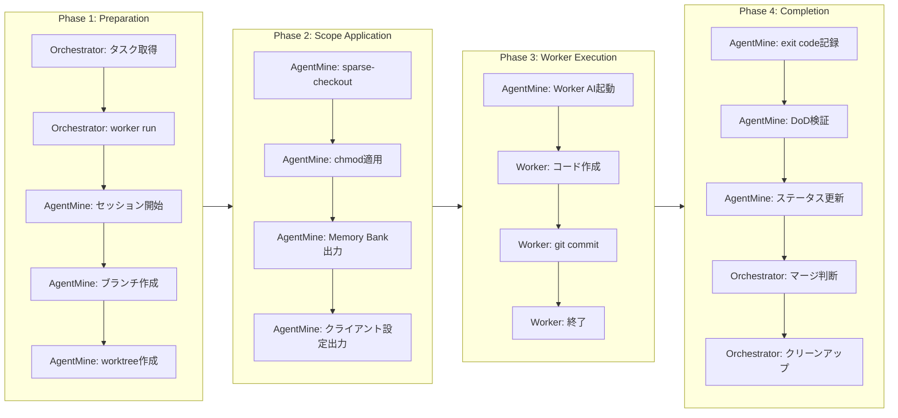
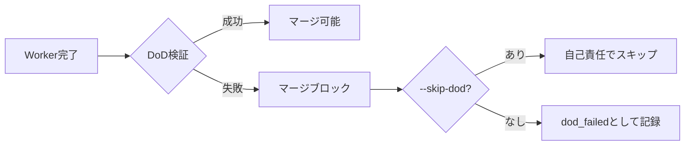
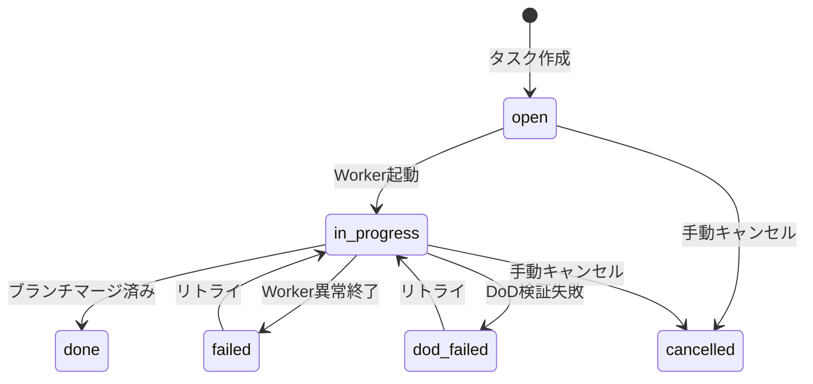

# Worker Lifecycle

## 目的

Worker起動から完了までの全フローを定義する。本ドキュメントはAgentMineにおけるWorker実行のSSoT（Single Source of Truth）である。

## 背景

AgentMineは「並列AI開発の実行環境」であり、Worker（AI）が安全にコードを作成できる隔離環境を提供する。OrchestratorがWorkerを起動し、AgentMineがworktree作成・スコープ適用・DoD検証・セッション記録を担当する。

**責務分離の理由:**
- Orchestratorは「何を実行するか」を判断する（計画者）
- AgentMineは「安全に実行する」ための仕組みを提供する（実行基盤）
- Workerは「コードを書く」ことに集中する（作業者）

## ライフサイクル概要

## Phase 1: Preparation（準備フェーズ）

### タスク取得

Orchestratorが実行対象タスクを選定する。取得する情報は以下の通り。

| 情報 | 用途 |
|------|------|
| タスクID・タイトル | Worker識別 |
| 説明 | プロンプト生成 |
| タイプ（feature/bug/refactor） | 作業方針の決定 |
| 優先度 | 実行順序の判断 |
| 依存関係 | 並列実行可否の判断 |
| 担当アクター | Worker選定 |

### Worker起動

Orchestratorが`agentmine worker run`コマンドを実行する。

| オプション | 説明 | デフォルト |
|------------|------|------------|
| --exec | Worker AIを自動起動 | なし（プロンプト生成のみ） |
| --detach | バックグラウンド実行 | フォアグラウンド |
| --agent | 使用するエージェント名 | タスクの割り当てエージェント |
| --timeout | タイムアウト秒数 | 300秒 |
| --skip-dod | DoD検証をスキップ | 検証実行 |

**--execの意図:** 省略時はworktree準備とプロンプト生成のみ行い、Worker起動は行わない。これにより手動でWorkerを操作したい場合に対応する。

**--detachの意図:** 並列実行時に複数Workerをバックグラウンドで起動し、`worker wait`で一括待機する運用を可能にする。

### セッション開始

AgentMineがセッションをDBに記録する。記録する情報は以下の通り。

| フィールド | 値 |
|------------|-----|
| taskId | 対象タスクのID |
| agentId | 使用するエージェントのID |
| branch | task-{taskId}-s{sessionId} |
| worktreePath | .agentmine/worktrees/task-{taskId} |
| status | running |
| startedAt | 現在時刻 |
| pid | Worker起動後に設定 |

**ブランチ命名規則の理由:** `task-<taskId>-s<sessionId>`形式により、同一タスクの複数回リトライを区別できる。sessionIdはDB自動採番で一意性を保証。

### worktree作成

AgentMineがGit worktreeを作成する。

| 項目 | 値 |
|------|-----|
| 作成先 | .agentmine/worktrees/task-{taskId}/ |
| ベースブランチ | 設定による（デフォルト: origin/develop） |
| 作成ブランチ | task-{taskId}-s{sessionId} |

**worktree隔離の理由:** 各Workerが独立した作業ディレクトリを持つことで、並列実行時のファイル競合を防ぐ。

## Phase 2: Scope Application（スコープ適用フェーズ）

### スコープ適用の意図

物理的にファイルアクセスを制限することで、Worker AIの自動承認モードを安全に使用可能にする。

**なぜ物理的制限か:**
- 論理的制限（プロンプト指示）はAIが無視する可能性がある
- 物理的制限はAIが回避不可能
- 自動承認モードでもスコープ外への影響を防げる

### スコープ優先順位

| 優先順位 | スコープ | 物理的状態 | 実装方法 |
|----------|---------|-----------|----------|
| 1（最高） | exclude | ファイルが存在しない | git sparse-checkout |
| 2 | read | 読み取り専用 | chmod a-w |
| 3 | write | 書き込み可能 | デフォルト |

### sparse-checkout適用

excludeパターンに一致するファイルを物理的に除外する。

**適用例:**
- `**/*.env` → 環境変数ファイルを除外
- `**/secrets/**` → 秘密情報ディレクトリを除外
- `**/.env.*` → 環境別設定を除外

**除外の理由:** 機密情報がWorkerに漏洩することを防ぐ。sparse-checkoutはGitレベルでファイルを展開しないため、AIがどのような手段を使ってもアクセス不可能。

### chmod適用

writeスコープ外のファイルを読み取り専用にする。

**適用結果:**
- write対象（例: src/, tests/）: 編集可能
- read対象（例: docs/, README.md）: 参照のみ
- exclude対象（例: .env）: 存在しない

### Memory Bank出力

DBからMemory Bankを取得し、worktree内にスナップショットを出力する。

| 出力先 | 内容 |
|--------|------|
| .agentmine/memory/{category}/{id}.md | status=activeのMemory |

**スナップショット出力の理由:**
- WorkerはDBにアクセスできない（隔離されているため）
- ファイルとして配置することでWorkerが参照可能になる
- read-onlyとして配置し、Workerによる変更を防ぐ

### クライアント設定出力

AIクライアント用の設定ファイルを生成する。

| AIクライアント | 設定ファイル |
|----------------|-------------|
| Claude Code | .claude/CLAUDE.md |
| Codex | .codex/CODEX.md |
| その他 | .agentmine/prompt.md |

**設定ファイルの内容:**
- タスク情報（ID、タイトル、説明）
- エージェント指示（agents.promptContent）
- スコープ情報
- Memory Bank要約と参照一覧
- 共通作業指示

## Phase 3: Worker Execution（実行フェーズ）

### Worker AI起動

AgentMineがworktree内でAIクライアントを起動する。

**対応AIクライアント:**

| クライアント | 自動承認フラグ |
|-------------|--------------|
| Claude Code | --dangerously-skip-permissions |
| Codex | --full-auto |
| Aider | --yes |
| Gemini CLI | -y |

**タイムアウト設定:**
- デフォルト: 300秒
- SIGTERMで graceful shutdown
- タイムアウト時のexit code: 124

### Worker作業内容

Workerは以下の作業を行う。

| 順序 | 作業 | 必須 |
|------|------|------|
| 1 | 既存コード確認 | 推奨 |
| 2 | コード作成・編集 | 必須 |
| 3 | テスト追加 | タスク依存 |
| 4 | ローカル検証 | 任意 |
| 5 | コミット | 必須 |

**Workerの制約:**
- AgentMineコマンド実行不可（DBアクセスなし）
- worktree外のファイルアクセス不可
- スコープ外のファイル編集不可（物理的に制限）

### Worker終了

Workerは作業完了後、exit codeを返して終了する。

| exit code | 意味 |
|-----------|------|
| 0 | 成功 |
| 1-123 | エラー（AIクライアント依存） |
| 124 | タイムアウト |
| 125-255 | その他のエラー |

## Phase 4: Completion（完了フェーズ）

### exit code記録

AgentMineがWorkerのexit codeをセッションに記録する。

| exit code | session.status |
|-----------|----------------|
| 0 | completed |
| それ以外 | failed |

### DoD検証

**重要:** DoD（Definition of Done）検証はAgentMineが強制実行する。Orchestratorの任意ではない。

**DoD検証の内容:**

| 項目 | 実行内容 | 失敗時の意味 |
|------|---------|-------------|
| lint | pnpm lint | コードスタイル違反 |
| test | pnpm test | テスト失敗 |
| build | pnpm build | ビルドエラー |

**なぜ仕組み化するか:**
- Orchestratorが検証をスキップしても何も起きない、という状況を避ける
- 責任の所在を明確にする（DoDが通らないとマージ不可）
- スコープ制御と同様の「安全装置」として位置づける

**DoD定義の取得元:**
- エージェント定義の`dod`フィールド
- タスクの`dod`フィールド（上書き用）
- 例: `dod: ["pnpm lint", "pnpm test", "pnpm build"]`

### ステータス更新

DoD検証結果をセッションに記録する。

| session.dodResult | 意味 |
|-------------------|------|
| passed | DoD全項目成功 |
| failed | DoD失敗（マージブロック） |
| skipped | --skip-dodで明示的にスキップ |
| timeout | DoD実行がタイムアウト |

### マージ判断

Orchestratorがマージを実行するか判断する。

**判断基準:**
- session.dodResult = passedの場合のみマージ可能
- コンフリクト発生時はOrchestratorが解決または失敗扱いを判断
- マージ成功後、AgentMineがブランチのマージ状態を検出しタスクをdoneに更新

### クリーンアップ

Orchestratorが`agentmine worker done`を実行する。

**実行内容:**
- worktree削除
- ブランチ削除（マージ済みの場合）
- セッションステータスの最終確認

## タスクステータス判定

タスクステータスは観測可能な事実から自動判定する。

**判定ロジック:**

| 条件 | ステータス |
|------|-----------|
| セッションなし | open |
| 手動キャンセル | cancelled |
| git log base..branch が空 | done（マージ済み） |
| PIDが存在し実行中 | in_progress |
| dodResult = failed | dod_failed |
| 全セッションが失敗 | failed |
| その他 | in_progress |

## プロンプト構成

Worker起動時に生成するプロンプトの構成要素。

| セクション | 内容 | 出典 | 展開方式 |
|-----------|------|------|----------|
| Task Header | ID、タイトル、タイプ、優先度 | tasksテーブル | 全文 |
| Description | タスクの詳細説明 | tasks.description | 全文 |
| Agent Instructions | エージェント固有の指示 | agents.promptContent | 全文 |
| Scope | ファイルアクセス範囲 | agents.scope | 全文 |
| Memory Bank | プロジェクトコンテキスト | memoriesテーブル | 要約 + 参照一覧 |
| Instructions | 共通作業指示 | ハードコード | 全文 |

**Memory Bank展開の理由:** 全文を注入するとトークン数が膨大になるため、要約と参照一覧のみ注入し、詳細はWorkerが必要に応じて.agentmine/memory/から読み込む。

## 実行パターン

### 単一Worker実行

| 手順 | 実行者 | 操作 |
|------|--------|------|
| 1 | Orchestrator | タスク取得 |
| 2 | Orchestrator | worker run --exec |
| 3 | AgentMine | 準備・実行・完了処理 |
| 4 | Orchestrator | マージ実行 |
| 5 | Orchestrator | worker done |

### 並列Worker実行

| 手順 | 実行者 | 操作 |
|------|--------|------|
| 1 | Orchestrator | 複数タスク取得 |
| 2 | Orchestrator | worker run --exec --detach（複数回） |
| 3 | Orchestrator | worker wait（全Worker完了待ち） |
| 4 | Orchestrator | 各Workerの結果確認・マージ（順次） |
| 5 | Orchestrator | worker done（各Worker） |

## 未確定事項

| 項目 | 現状 | 検討中 |
|------|------|--------|
| DoD検証の並列実行 | 順次実行 | 複数Worker完了後の並列検証 |
| 自動リトライ | なし | 設定可能な回数制限付き |
| worktree自動クリーンアップ | worker done必須 | 一定時間後の自動削除 |

## 関連ドキュメント

- 概要: @01-introduction/overview.md
- アーキテクチャ: @02-architecture/architecture.md
- Orchestrator/Workerモデル: @03-core-concepts/orchestrator-worker.md
- スコープ制御: @03-core-concepts/scope-control.md
- 事実ベース判定: @03-core-concepts/observable-facts.md
- Agent定義: @05-features/agent-system.md
- Memory Bank: @05-features/memory-bank.md
- 用語集: @appendix/glossary.md
