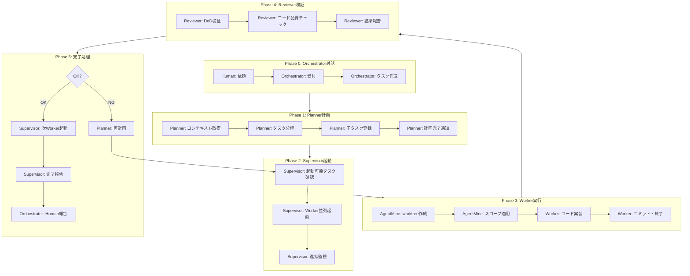
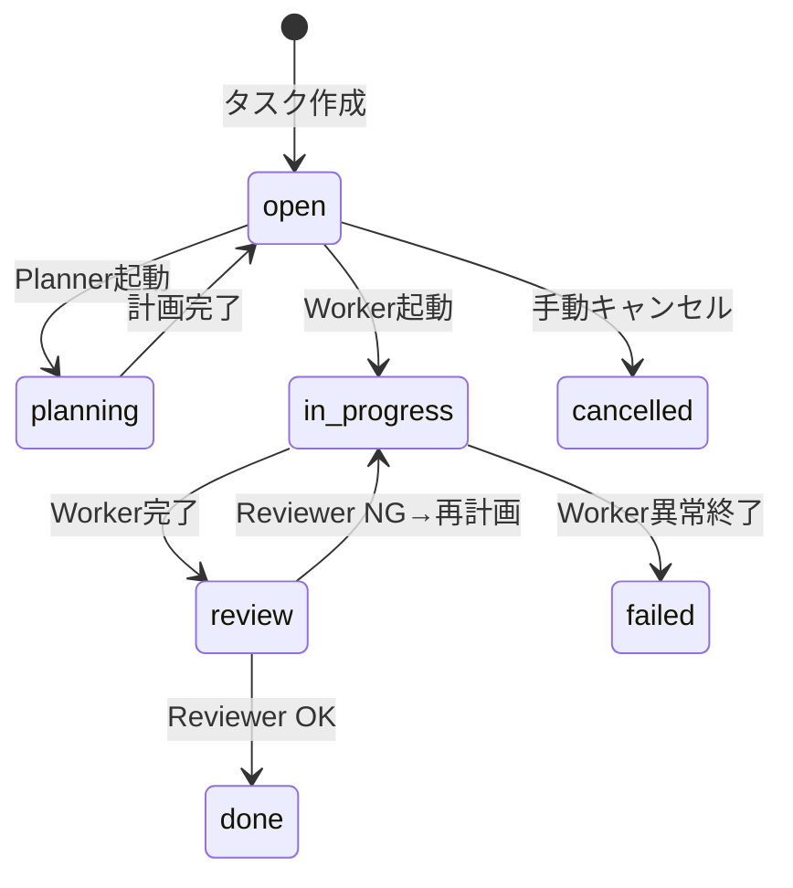

# 5層セッションライフサイクル

## 目的

5層アーキテクチャ（Orchestrator/Planner/Supervisor/Worker/Reviewer）によるセッション実行の全フローを定義する。本ドキュメントはAgentMineにおけるセッション実行のSSoT（Single Source of Truth）である。

## 背景

AgentMineは「並列AI開発の実行環境」であり、AI層（5層）が安全にコードを作成できる隔離環境を提供する。

**責務分離:**
- Orchestrator: 人間との対話、依頼受付、完了報告
- Planner: タスク分解、依存関係設定、再計画
- Supervisor: Worker起動、進捗監視、NG対応
- Worker: コード実装（worktreeで隔離）
- Reviewer: 品質検証（DoD + コードレビュー）
- AgentMine: 判断材料の提供、実行環境、プロセス管理

## ライフサイクル概要



## Phase 0: Orchestrator対話

### Human依頼

人間がOrchestratorに依頼を出す。

| 方法 | 例 |
|------|-----|
| 対話 | 「認証機能を実装して」 |
| Web UI | タスク作成フォーム |
| CLI | `agentmine task create "認証機能"` |

### タスク作成

OrchestratorがAgentMineにタスクを作成する。

| フィールド | 値 |
|------------|-----|
| title | 認証機能を実装 |
| description | 詳細説明 |
| status | open |
| type | feature |
| priority | high |

## Phase 1: Planner計画

### コンテキスト取得

PlannerがAgentMineからコンテキストを取得する。

| 取得情報 | 用途 |
|---------|------|
| タスク詳細 | 分解対象の理解 |
| Memory Bank | プロジェクト規約・アーキテクチャ |
| 既存タスク | 重複・依存の確認 |
| コードベース情報 | 実装箇所の特定 |

### タスク分解

Plannerが大タスクを実行可能な粒度に分解する。

**分解例:**
```
親タスク: 認証機能を実装
├── 子1: DBスキーマ作成 (id: 101)
├── 子2: APIエンドポイント (id: 102, blockedBy: [101])
└── 子3: フロントUI (id: 103, blockedBy: [102])
```

### 子タスク登録

分解結果をDBに登録する。

| フィールド | 値 |
|------------|-----|
| parentId | 親タスクID |
| blockedBy | 依存タスクID配列 |
| status | open |

### 計画完了通知

PlannerがSupervisorに計画完了を通知する。

## Phase 2: Supervisor起動

### 起動可能タスク確認

Supervisorが起動可能なタスクを特定する。

**条件:**
- status = open
- blockedBy が全て完了済み

### Worker並列起動

Supervisorが`agentmine worker run`でWorkerを起動する。

| オプション | 説明 | デフォルト |
|------------|------|------------|
| --exec | Worker AIを自動起動 | なし |
| --detach | バックグラウンド実行 | フォアグラウンド |
| --agent | 使用するエージェント名 | タスク割り当て |
| --timeout | タイムアウト秒数 | 300秒 |

### 進捗監視

Supervisorが実行中のWorkerを監視する。

| 監視項目 | 方法 |
|---------|------|
| プロセス状態 | PID存在確認 |
| 出力 | stdout/stderr（WebSocket経由） |
| 経過時間 | タイムアウト判定 |

## Phase 3: Worker実行

### worktree作成

AgentMineがGit worktreeを作成する。

| 項目 | 値 |
|------|-----|
| 作成先 | .agentmine/worktrees/task-{taskId}/ |
| ベースブランチ | 設定による（デフォルト: origin/develop） |
| 作成ブランチ | task-{taskId}-s{sessionId} |

### スコープ適用

AgentMineが物理的にファイルアクセスを制限する。

| 優先順位 | スコープ | 物理的状態 | 実装方法 |
|----------|---------|-----------|----------|
| 1（最高） | exclude | ファイルが存在しない | git sparse-checkout |
| 2 | read | 読み取り専用 | chmod a-w |
| 3 | write | 書き込み可能 | デフォルト |

### Memory Bank出力

DBからMemory Bankを取得し、worktree内にスナップショットを出力する。

| 出力先 | 内容 |
|--------|------|
| .agentmine/memory/{category}/{id}.md | status=activeのMemory |

### Worker AI起動

AgentMineがworktree内でAIクライアントを起動する。

| クライアント | 自動承認フラグ |
|-------------|--------------|
| Claude Code | --dangerously-skip-permissions |
| Codex | --full-auto |
| Aider | --yes |
| Gemini CLI | -y |

### Worker作業

Workerは与えられた指示に従ってコードを実装する。

| 順序 | 作業 | 必須 |
|------|------|------|
| 1 | 既存コード確認 | 推奨 |
| 2 | コード作成・編集 | 必須 |
| 3 | テスト追加 | タスク依存 |
| 4 | ローカル検証 | 任意 |
| 5 | コミット | 必須 |

**重要**: Workerは意図を挟まない。与えられた指示を実行するのみ。

### Worker終了

Workerは作業完了後、exit codeを返して終了する。

| exit code | 意味 |
|-----------|------|
| 0 | 成功 |
| 1-123 | エラー |
| 124 | タイムアウト |

## Phase 4: Reviewer検証

### DoD検証

Reviewerが品質検証を実行する。

| 項目 | 実行内容 | 失敗時の意味 |
|------|---------|-------------|
| lint | pnpm lint | コードスタイル違反 |
| test | pnpm test | テスト失敗 |
| build | pnpm build | ビルドエラー |

### コード品質チェック

Reviewer AIがコードレビューを実行する。

| チェック項目 | 内容 |
|-------------|------|
| 設計妥当性 | タスク要件との整合性 |
| セキュリティ | 脆弱性の有無 |
| パフォーマンス | 明らかな問題 |

### 結果報告

ReviewerがSupervisorに結果を報告する。

| 結果 | 意味 |
|------|------|
| OK | 検証合格、次のステップへ |
| NG | 検証失敗、再計画が必要 |

## Phase 5: 完了処理

### OK時のフロー

1. Supervisorが次のWorkerを起動（blockedBy解消分）
2. 全タスク完了時、Supervisorが完了報告
3. OrchestratorがHumanに報告

### NG時のフロー

1. ReviewerがSupervisorにNG報告
2. SupervisorがPlannerに再計画依頼
3. Plannerがタスク定義を修正
4. Phase 2に戻る

**重要**: WorkerへのNG差し戻しは行わない。問題は常に「指示側」（Planner）にある。

### NG時の責任

| NG原因 | 責任者 | 対応 |
|--------|--------|------|
| タスク説明が曖昧 | Planner | 再分解 |
| 粒度が大きすぎ | Planner | 追加分解 |
| 依存関係ミス | Planner | 計画修正 |
| 実行環境の問題 | Supervisor | 環境調整・リトライ |
| lint/test失敗 | Planner経由 | タスク再定義 |

## タスクステータス判定

タスクステータスは観測可能な事実から自動判定する。



## プロセス管理（ADR-008）

AgentMineがNode.jsの`child_process`でAIプロセスを管理する。

### セッション構成

```
AgentMine Session
├── Orchestrator (対話セッション)
├── Planner (必要時起動)
├── Supervisor (計画後〜完了まで)
├── Worker 1..N (タスクごと)
└── Reviewer (Worker完了後)
```

### Web UI可視化

各プロセスの出力をWebSocket経由でリアルタイム配信する。

```
┌─────────────────────────────────────────────────┐
│ [Orchestrator] [Planner] [Supervisor] [Workers] │
├─────────────────────────────────────────────────┤
│ > 認証機能作って                                 │
│ < 了解、Plannerに依頼します                      │
│ ...                                             │
├─────────────────────────────────────────────────┤
│ #1 認証機能 ████████░░ 2/3                       │
└─────────────────────────────────────────────────┘
```

## CLIコマンド

### セッション管理

```bash
# セッション開始
agentmine session start --name auth-feature

# 状態確認
agentmine session status

# 入力送信
agentmine session send orchestrator "認証機能を実装して"

# セッション終了
agentmine session stop
```

### Worker管理

```bash
# Worker起動（Supervisorが実行）
agentmine worker run <taskId> --exec --detach

# 状態確認
agentmine worker status

# 完了待ち
agentmine worker wait <taskId>

# クリーンアップ
agentmine worker done <taskId>
```

## 関連ドキュメント

- 5層アーキテクチャ: @03-core-concepts/orchestrator-worker.md
- アーキテクチャ: @02-architecture/architecture.md
- スコープ制御: @03-core-concepts/scope-control.md
- ADR-007 5層アーキテクチャ: @10-decisions/007-five-layer-architecture.md
- ADR-008 プロセス管理: @10-decisions/008-process-management-webui.md
- 用語集: @appendix/glossary.md
