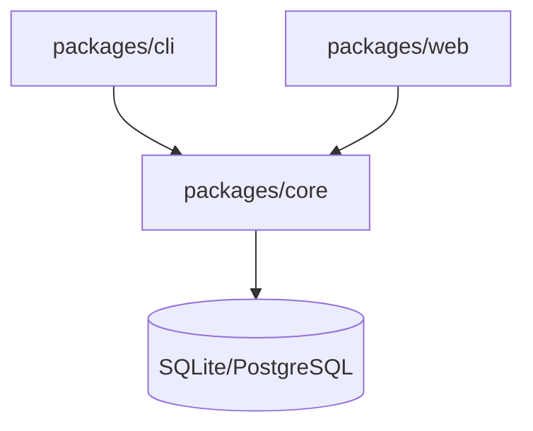

# 開発ガイド

## 目的

AgentMine本体の開発に参加するための手順とガイドラインを定義する。本ドキュメントは開発者向けガイドのSSoT（Single Source of Truth）である。

## 背景

AgentMineはオープンソースプロジェクトとして、複数の開発者が協力して開発を進める。一貫した開発体験を提供するため、環境構築から貢献方法までを標準化する。

**なぜこのガイドが必要か:**
- 新規参加者が迅速に開発を開始できる
- コード品質とスタイルの統一
- レビュープロセスの効率化

## 開発環境

### 必要なツール

| ツール | バージョン | 用途 |
|--------|-----------|------|
| Node.js | 20.x以上 | ランタイム |
| pnpm | 8.x以上 | パッケージマネージャー |
| Git | 2.x以上 | バージョン管理 |
| SQLite | 3.x | ローカルDB |

### オプション

| ツール | 用途 |
|--------|------|
| Docker | PostgreSQLローカル実行 |

## セットアップ手順

| 手順 | 操作 | 説明 |
|------|------|------|
| 1 | リポジトリクローン | git clone |
| 2 | 依存関係インストール | pnpm install |
| 3 | 環境変数設定 | .env.example → .env |
| 4 | DBマイグレーション | pnpm db:migrate |
| 5 | 開発サーバー起動 | pnpm dev |

## パッケージ構成

| パッケージ | パス | 説明 |
|-----------|------|------|
| @agentmine/cli | packages/cli | CLIアプリケーション、MCPサーバー |
| @agentmine/web | packages/web | Next.js Web UI |
| @agentmine/core | packages/core | 共有ロジック（Services, Models, DB） |

### 依存関係

## 開発コマンド

| コマンド | 説明 |
|---------|------|
| pnpm dev | 全パッケージ同時起動（開発モード） |
| pnpm build | 全パッケージビルド |
| pnpm test | 全パッケージテスト実行 |
| pnpm lint | リント実行 |
| pnpm lint:fix | リント自動修正 |
| pnpm typecheck | 型チェック |

### パッケージ別

| コマンド | 説明 |
|---------|------|
| pnpm --filter @agentmine/cli dev | CLIのみ開発モード |
| pnpm --filter @agentmine/web dev | Web UIのみ開発モード |
| pnpm --filter @agentmine/core test | Coreのテストのみ実行 |

## コーディング規約

### 基本ルール

| 項目 | 規約 |
|------|------|
| インデント | 2スペース |
| 引用符 | シングルクォート |
| セミコロン | なし |
| 改行コード | LF |

### TypeScript

| 項目 | 規約 |
|------|------|
| strict mode | 有効 |
| any型 | 原則禁止 |
| 型推論 | 可能な限り活用 |
| インターフェース | I接頭辞不要（例: User, not IUser） |

### 命名規則

| 対象 | 規則 | 例 |
|------|------|-----|
| ファイル | kebab-case | task-service.ts |
| クラス | PascalCase | TaskService |
| 関数・変数 | camelCase | createTask |
| 定数 | UPPER_SNAKE_CASE | MAX_RETRY_COUNT |
| 型・インターフェース | PascalCase | TaskStatus |

## Git運用

### ブランチ戦略

| ブランチ | 用途 |
|---------|------|
| main | 本番リリース |
| develop | 開発統合 |
| feature/* | 機能開発 |
| fix/* | バグ修正 |
| docs/* | ドキュメント |

### コミットメッセージ

Conventional Commits形式を使用。

| プレフィックス | 用途 |
|---------------|------|
| feat: | 新機能 |
| fix: | バグ修正 |
| docs: | ドキュメント |
| refactor: | リファクタリング |
| test: | テスト |
| chore: | その他 |

### Co-Authored-By

AIツールを使用した場合は独自ドメインを使用。

| AI | 形式 |
|----|------|
| Claude Code | Co-Authored-By: Claude \<claude@agentmine.local\> |
| Codex | Co-Authored-By: Codex \<codex@agentmine.local\> |

**注意:** 外部サービスのメールアドレス（noreply@anthropic.com等）は使用しない。

## テスト

### テストフレームワーク

| ツール | 用途 |
|--------|------|
| Vitest | ユニットテスト |
| Playwright | E2Eテスト（Web UI） |

### テスト構成

| 種類 | 場所 | 命名 |
|------|------|------|
| ユニットテスト | src/**/*.test.ts | *.test.ts |
| 統合テスト | tests/integration/ | *.integration.test.ts |
| E2Eテスト | tests/e2e/ | *.e2e.ts |

### テスト実行

| コマンド | 説明 |
|---------|------|
| pnpm test | 全テスト実行 |
| pnpm test:watch | ウォッチモード |
| pnpm test:coverage | カバレッジ計測 |

## PRプロセス

| 手順 | 説明 |
|------|------|
| 1 | featureブランチ作成 |
| 2 | 実装・テスト |
| 3 | lint/typecheck/test通過確認 |
| 4 | PR作成 |
| 5 | レビュー |
| 6 | マージ |

### PRチェックリスト

| 項目 | 必須 |
|------|:----:|
| テスト追加/更新 | ✓ |
| lint通過 | ✓ |
| typecheck通過 | ✓ |
| ドキュメント更新 | 必要に応じて |

## トラブルシューティング

| 問題 | 解決策 |
|------|--------|
| pnpm installが失敗 | node_modules削除後に再実行 |
| 型エラーが解消されない | pnpm typecheck --force |
| DBマイグレーションエラー | .agentmine/data.db削除後に再実行 |
| ポート競合 | 環境変数でポート変更 |

## 関連ドキュメント

- インストール: @08-deployment/installation.md
- アーキテクチャ: @02-architecture/architecture.md
- データモデル: @04-data/data-model.md
- 用語集: @appendix/glossary.md
