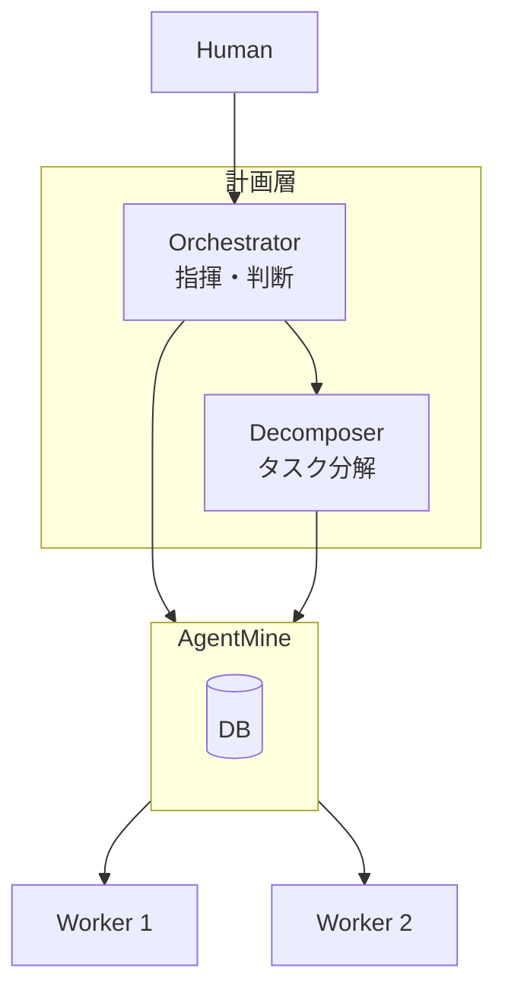
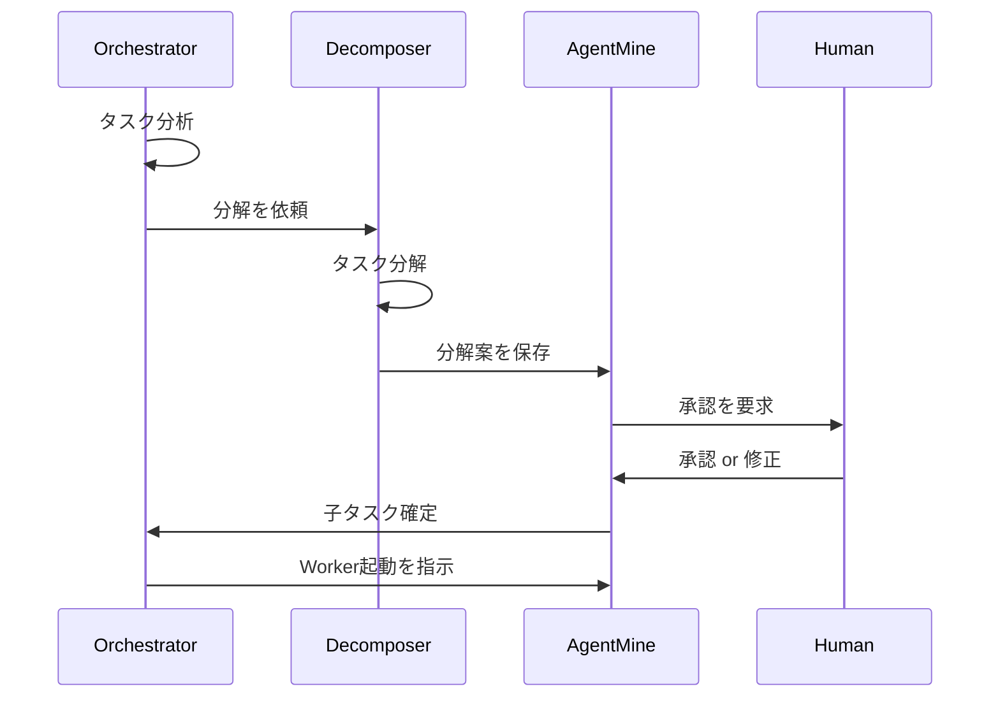

---
depends_on:
  - ../03-core-concepts/orchestrator-worker.md
tags: [decisions, adr, architecture, ai-agnostic, orchestrator, decomposer]
ai_summary: "Orchestrator層をAI非依存・3層構造で設計し、MCP/API両対応とする決定"
---

# ADR-005: AI非依存のOrchestrator設計

> Status: Accepted
> 最終更新: 2026-01-28

## コンテキスト

AgentMineはWorker層で複数のAIクライアント（Claude Code、Codex、Aider、Gemini CLI等）に対応している。Orchestrator層も同様にAI非依存にすべきか、また責務をどう分割すべきか検討が必要であった。

### 背景

- 主流のAI開発ツール（multi-agent-shogun等）は特定AIに密結合している
- AIの進化が速く、特定AIへのロックインはリスクになる
- 組織利用時にAI選択の自由度が求められる
- Orchestratorに全責務を載せると複雑化してバグりやすい

## 決定事項

### 1. AI非依存設計

Orchestrator層をAI非依存に設計する。

| 層 | 実装 | AI依存度 |
|-----|------|---------|
| 判断（AI） | MCP / API経由でAgentMineにアクセス | 可変（どのAIでも可） |
| 仕組み（AgentMine） | 提案保存・承認管理・Worker起動 | 固定 |
| 可視化（Web UI） | 提案表示・承認ボタン・かんばん | 固定 |

### 2. 3層構造（Orchestrator / Decomposer / Worker）

計画層を2つの役割に分離する。

| 役割 | 責務 | 起動頻度 |
|------|------|---------|
| Orchestrator | 次のアクション判断、進捗監視、マージ判断 | 高（常時） |
| Decomposer | タスク分解、依存関係分析 | 低（必要時のみ） |
| Worker | コード実装 | 中（タスクごと） |

### 3. MCP先行、API後追い

| フェーズ | 対応 | 対象ユーザー |
|---------|------|-------------|
| Phase 1 | MCP経由 | 個人開発（Max契約活用） |
| Phase 2 | API直接呼び出し | チーム・組織（小回り重視） |

インターフェースを切っておき、実装を差し替え可能にする。

### 4. 承認ポイントは「分解結果」

Decomposer起動はOrchestratorが自動判断する。人間の承認は分解結果に対して行う。

| 承認ポイント | 採否 | 理由 |
|-------------|------|------|
| 「分解していい？」（起動前） | ❌ | 自然な流れを妨げる |
| 「この分解案でいい？」（結果） | ✅ | 人間が品質を判断できる |

### 5. 実装優先度

| 優先度 | 対象 | 理由 |
|--------|------|------|
| 1 | CLI | 実際の作業はCLI先行で行うため |
| 2 | Web UI | 可視化・承認UIは後から追加 |

## 検討した選択肢

### 選択肢1: 特定AI密結合

| 項目 | 内容 |
|------|------|
| 概要 | 特定AIクライアントの機能を前提とした設計 |
| メリット | 実装がシンプル、そのAIの機能を最大活用できる |
| デメリット | AI乗り換えが困難、ロックイン |

### 選択肢2: AI非依存・3層構造

| 項目 | 内容 |
|------|------|
| 概要 | AgentMine側で仕組みを提供、AIは交換可能、責務を分離 |
| メリット | AI乗り換え容易、責務明確、デバッグしやすい |
| デメリット | 抽象化コスト、MCP/API両対応の実装コスト |

## 決定理由

選択肢2（AI非依存・3層構造）を採用した理由：

- Worker層で既にAI非依存を実現しており、設計思想の一貫性が保てる
- Orchestratorに全責務を載せると複雑化し、バグりやすくなる
- Decomposerを分離することで、モデル使い分けやコスト最適化が可能になる
- 個人開発（MCP）と組織利用（API）の両方に対応できる

## 結果

### ポジティブな影響

- 特定AIへのロックインを回避できる
- 責務分離によりデバッグしやすくなる
- モデル使い分けでコスト最適化できる
- 組織利用時の柔軟性が向上する

### ネガティブな影響

- MCP/API両対応の実装コストが発生する
- 3層構造により全体の複雑性は増す
- 層間の通信設計が必要になる

## 未決定事項

以下は今後検討が必要：

- ~~依存関係のモデル化方法~~ → [ADR-006](./006-dependency-and-proposals.md) で決定
- ~~提案の保存先（新テーブル or 既存拡張）~~ → [ADR-006](./006-dependency-and-proposals.md) で決定
- ~~3層構造の責務分担~~ → [ADR-007](./007-five-layer-architecture.md) で5層に拡張
- 自動承認モードの条件設定
- 失敗時のリトライ戦略

## 後続ADR

本ADRは以下のADRで拡張されている：

- [ADR-006](./006-dependency-and-proposals.md) - 依存関係モデルと提案テーブル
- [ADR-007](./007-five-layer-architecture.md) - 5層アーキテクチャ（3層→5層に拡張）

## 関連ADR

- [ADR-001](./001-typescript-monorepo.md) - TypeScript monorepo採用
- [ADR-002](./002-sqlite-default.md) - SQLiteをデフォルトDB

## 関連ドキュメント

- [Orchestrator/Worker](../03-core-concepts/orchestrator-worker.md) - 役割定義
- [タスク分解](../03-core-concepts/task-decomposition.md) - 分解の設計案
