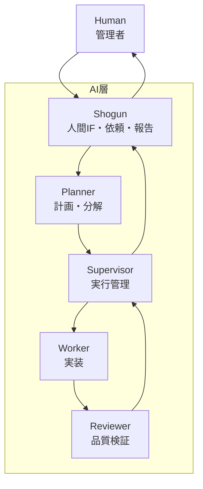
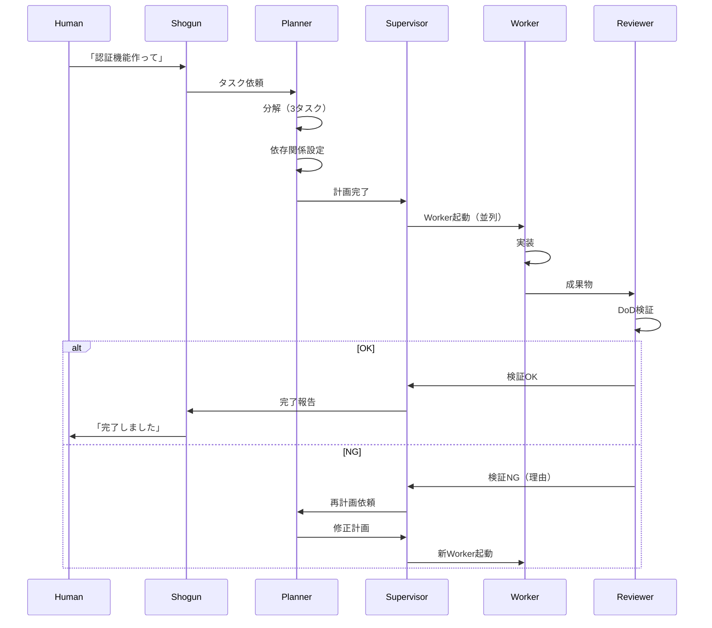

---
depends_on:
  - ./005-ai-agnostic-orchestration.md
  - ./006-dependency-and-proposals.md
tags: [decisions, adr, architecture, shogun, planner, supervisor, worker, reviewer]
ai_summary: "3層構造を5層に拡張し、Shogun/Planner/Supervisor/Worker/Reviewerの責務を明確化"
---

# ADR-007: 5層アーキテクチャ

> Status: Accepted
> 最終更新: 2026-01-29

## コンテキスト

ADR-005で3層構造（Orchestrator / Decomposer / Worker）を採用したが、運用上の課題が見つかった。

### 課題

| 課題 | 説明 |
|------|------|
| Decomposerの責務過多 | 分解・Worker起動・監視・NG対応を一人で担当 |
| タスク分解の品質 | Orchestratorが兼任すると分解のアラが多い |
| 差し戻し先の曖昧さ | WorkerにNG差し戻しは無意味（意図を挟めない） |
| 検収フローの欠如 | 品質チェックの責任者が不明確 |

### 参考: multi-agent-shogun

戦国時代の軍制をモデルにした階層構造が有効であることが実証されている。

## 決定事項

### 5層構造の採用



### 各層の責務

| 層 | 責務 | やらないこと |
|----|------|-------------|
| Shogun | 人間との対話、依頼受付、完了報告 | 分解、Worker管理 |
| Planner | タスク分解、依存関係設定、計画作成 | Worker起動、監視 |
| Supervisor | Worker起動、進捗監視、NG対応 | 人間対話、分解 |
| Worker | コード実装 | 判断、他層との通信 |
| Reviewer | DoD検証、品質チェック | 実装、計画 |

### 人間チームとの対応

| AI役割 | 人間の役割 | 起動頻度 |
|--------|-----------|---------|
| Shogun | 経営者/依頼者 | 常駐（対話セッション） |
| Planner | アーキテクト | タスク受付時 |
| Supervisor | PM | 計画確定後〜完了まで |
| Worker | 開発者 | タスクごと |
| Reviewer | QA | Worker完了後 |

### 標準フロー



### NG時の責任

| NG原因 | 責任者 | 対応 |
|--------|--------|------|
| タスク説明が曖昧 | Planner | 再分解 |
| 粒度が大きすぎ | Planner | 追加分解 |
| 依存関係ミス | Planner | 計画修正 |
| 実行環境の問題 | Supervisor | 環境調整・リトライ |
| lint/test失敗 | Planner経由 | タスク再定義 |

**重要**: WorkerへのNG差し戻しは行わない。Workerは与えられた指示を実行するのみで、意図を挟む余地がない。問題は常に「指示側」にある。

### AgentMineとの関係

AgentMineは判断しない。各層に判断材料を提供するのみ。

| 層 | AgentMineの役割 |
|----|----------------|
| Shogun | CLI/MCP/API経由でタスク登録 |
| Planner | コンテキストファイル提供、proposals保存 |
| Supervisor | worker run、status、監視API |
| Worker | worktree提供、スコープ制御 |
| Reviewer | DoD検証実行（自動） |

```
┌─────────────────────────────────────────────┐
│  AI層（判断する）                            │
│  Shogun / Planner / Supervisor / Worker     │
└─────────────────────────────────────────────┘
        ↓ CLI / MCP / API
┌─────────────────────────────────────────────┐
│  AgentMine（判断しない）                     │
│  - タスク管理                               │
│  - 状態提供                                 │
│  - 実行環境提供                             │
│  - 結果記録                                 │
└─────────────────────────────────────────────┘
```

## 検討した選択肢

### 選択肢1: 3層維持（ADR-005）

| 項目 | 内容 |
|------|------|
| 構成 | Orchestrator / Decomposer / Worker |
| メリット | シンプル |
| デメリット | Decomposer負荷大、検収フロー不明確 |

### 選択肢2: 4層（Decomposer分割なし）

| 項目 | 内容 |
|------|------|
| 構成 | Shogun / Decomposer / Worker / Reviewer |
| メリット | 検収追加でシンプル |
| デメリット | Decomposerの責務過多は解消されない |

### 選択肢3: 5層

| 項目 | 内容 |
|------|------|
| 構成 | Shogun / Planner / Supervisor / Worker / Reviewer |
| メリット | 責務明確、専門化、スケーラブル |
| デメリット | 層間通信コスト |

## 決定理由

選択肢3（5層）を採用した理由：

- 責務分離により各層が専門化できる
- Plannerは計画に、Supervisorは実行管理に集中
- NG時の責任が明確（Workerには戻さない）
- 人間のチーム構成（アーキテクト/PM/開発者/QA）と対応
- multi-agent-shogunで実証された構造に近い

## 結果

### ポジティブな影響

- 各層の責務が明確になる
- 品質チェック（Reviewer）がフローに組み込まれる
- NG時の対応が明確になる
- 将来的なスケーリング（複数Planner等）が可能

### ネガティブな影響

- 層間の通信設計が必要
- 5プロセス管理の複雑さ
- 初期実装コスト増

## 実装計画

### Phase 1: 基盤整備

- AgentMine APIの拡充（状態取得、コンテキスト生成）
- 各層向けのAgent定義テンプレート

### Phase 2: 各層の実装

| 層 | 実装方式 |
|----|---------|
| Shogun | Claude Code対話セッション（既存） |
| Planner | 専用Agent定義 + コンテキストファイル |
| Supervisor | 監視ループ + AgentMine API |
| Worker | worktree隔離（既存） |
| Reviewer | DoD自動検証 + AI品質チェック |

### Phase 3: 統合

- 層間通信プロトコル
- エラーハンドリング
- 監視・ログ

## 関連ADR

- [ADR-005](./005-ai-agnostic-orchestration.md) - AI非依存設計（本ADRで拡張）
- [ADR-006](./006-dependency-and-proposals.md) - 依存関係と提案テーブル

## 関連ドキュメント

- [Orchestrator/Worker](../03-core-concepts/orchestrator-worker.md) - 役割定義（要更新）
- [Worker実行フロー](../07-runtime/worker-lifecycle.md) - Worker詳細
