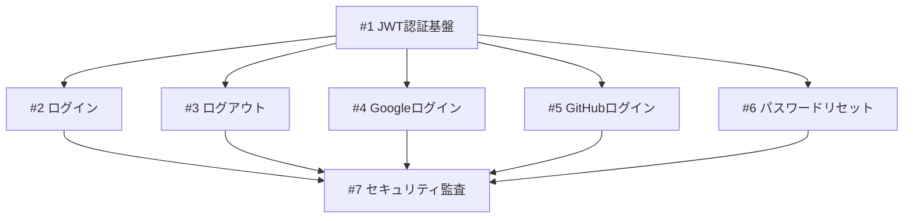

# Task Decomposition

TaskMaster AIから着想を得たPRD→タスク分解機能。

## 概要

PRD（Product Requirements Document）や要件定義を読み込み、
AIで構造化タスクに分解。複雑度分析・サブタスク展開も可能。

## 設計目標

1. **自動分解**: PRDから実行可能なタスクを自動生成
2. **複雑度分析**: タスクの難易度を数値化
3. **サブタスク展開**: 大きなタスクを細分化
4. **依存関係検出**: タスク間の順序を特定

## アーキテクチャ

```
┌─────────────────────────────────────────────────────────────┐
│                   Task Decomposition                         │
├─────────────────────────────────────────────────────────────┤
│                                                             │
│  ┌──────────┐    ┌──────────────┐    ┌──────────────┐     │
│  │  PRD.md  │───▶│  AI Parser   │───▶│ Task Graph   │     │
│  └──────────┘    └──────────────┘    └──────────────┘     │
│                         │                    │              │
│                         ▼                    ▼              │
│                  ┌──────────────┐    ┌──────────────┐     │
│                  │ Complexity   │    │  Dependency  │     │
│                  │ Analyzer     │    │  Resolver    │     │
│                  └──────────────┘    └──────────────┘     │
│                         │                    │              │
│                         └────────┬───────────┘              │
│                                  ▼                          │
│                         ┌──────────────┐                   │
│                         │    Tasks     │                   │
│                         │   Database   │                   │
│                         └──────────────┘                   │
└─────────────────────────────────────────────────────────────┘
```

## 機能

### 1. PRD Parse

PRDファイルを解析してタスクを生成。

```bash
agentmine task parse-prd ./docs/prd.md
```

**入力例（PRD）:**

```markdown
# ユーザー認証機能

## 概要
ユーザーがアプリケーションにログイン・ログアウトできる機能。

## 要件

### 機能要件
- メールアドレスとパスワードでログイン
- ソーシャルログイン（Google, GitHub）
- パスワードリセット機能
- セッション管理（JWT）

### 非機能要件
- レスポンス時間: 200ms以内
- セキュリティ: OWASP準拠
```

**出力:**

```
Parsed PRD: ./docs/prd.md

Generated Tasks:
┌────┬───────────────────────────────┬──────────┬────────────┐
│ ID │ Title                         │ Priority │ Complexity │
├────┼───────────────────────────────┼──────────┼────────────┤
│ #1 │ JWT認証基盤の実装              │ high     │ 6/10       │
│ #2 │ ログインエンドポイント実装     │ high     │ 4/10       │
│ #3 │ ログアウト機能実装             │ medium   │ 2/10       │
│ #4 │ Googleソーシャルログイン       │ medium   │ 5/10       │
│ #5 │ GitHubソーシャルログイン       │ medium   │ 5/10       │
│ #6 │ パスワードリセット機能         │ medium   │ 5/10       │
│ #7 │ セキュリティ監査・テスト       │ high     │ 7/10       │
└────┴───────────────────────────────┴──────────┴────────────┘

Dependencies detected:
  #2, #3, #4, #5, #6 → depends on #1
  #7 → depends on all

Create these tasks? [Y/n]
```

### 2. Complexity Analysis

タスクの複雑度を分析。

```bash
agentmine task analyze 3
```

**出力:**

```
Task #3: Googleソーシャルログイン

Complexity Analysis
───────────────────────────────────────────────

Score: 5/10

Factors:
  ├─ 外部API連携: +2
  ├─ OAuth2フロー: +2
  ├─ セキュリティ考慮: +1
  └─ 単一機能: -1

Estimated Effort:
  ├─ 実装: 2-3時間
  ├─ テスト: 1時間
  └─ 合計: 3-4時間

Suggested Subtasks:
  1. Google OAuth設定・クレデンシャル取得
  2. OAuth2コールバックエンドポイント実装
  3. ユーザー作成/紐付けロジック
  4. フロントエンド連携

Dependencies:
  └─ Task #1 (JWT認証基盤) - required

Risks:
  - Google API仕様変更の可能性
  - リダイレクトURL設定ミス
```

### 3. Task Expand

タスクをサブタスクに展開。

```bash
agentmine task expand 3 --depth 2
```

**出力:**

```
Expanding Task #3: Googleソーシャルログイン

Generated Subtasks:
┌──────┬────────────────────────────────────┬───────────┐
│ ID   │ Title                              │ Parent    │
├──────┼────────────────────────────────────┼───────────┤
│ #3.1 │ Google OAuth設定                   │ #3        │
│ #3.2 │ OAuth2コールバック実装             │ #3        │
│ #3.3 │ ユーザー紐付けロジック             │ #3        │
│ #3.4 │ フロントエンド連携                 │ #3        │
└──────┴────────────────────────────────────┴───────────┘

Task Tree:
#3 Googleソーシャルログイン
├── #3.1 Google OAuth設定
├── #3.2 OAuth2コールバック実装
├── #3.3 ユーザー紐付けロジック
└── #3.4 フロントエンド連携

Create these subtasks? [Y/n]
```

## API

### DecompositionService

```typescript
// packages/core/src/services/decomposition-service.ts

export class DecompositionService {
  constructor(
    private ai: AIClient,
    private taskService: TaskService,
  ) {}

  // PRD解析
  async parsePrd(
    filePath: string,
    options?: ParseOptions,
  ): Promise<ParsedTask[]>;

  // 複雑度分析
  async analyzeComplexity(taskId: number): Promise<ComplexityAnalysis>;

  // タスク展開
  async expandTask(
    taskId: number,
    depth?: number,
  ): Promise<ExpandedTask[]>;

  // 依存関係検出
  async detectDependencies(taskIds: number[]): Promise<Dependency[]>;
}
```

### 型定義

```typescript
interface ParsedTask {
  title: string;
  description: string;
  priority: Priority;
  type: TaskType;
  estimatedComplexity: number;
  suggestedDependencies: number[];
}

interface ComplexityAnalysis {
  score: number;           // 1-10
  factors: Factor[];       // 複雑度要因
  estimatedEffort: {
    implementation: string;
    testing: string;
    total: string;
  };
  suggestedSubtasks: string[];
  dependencies: Dependency[];
  risks: string[];
}

interface ExpandedTask {
  title: string;
  description: string;
  parentId: number;
  order: number;
}
```

## AI Prompts

### PRD Parser Prompt

```typescript
const PRD_PARSER_PROMPT = `
あなたはソフトウェア開発のタスク分解エキスパートです。
以下のPRD（要件定義）を読み、実行可能なタスクに分解してください。

## ルール
1. 各タスクは1つの明確な成果物を持つ
2. タスクは依存関係を考慮して順序付け
3. 複雑度は1-10で評価（10が最も複雑）
4. 優先度は要件の重要性に基づく

## 出力形式
JSON配列で出力:
[
  {
    "title": "タスクタイトル",
    "description": "詳細説明",
    "priority": "high|medium|low",
    "type": "feature|task|bug|refactor",
    "complexity": 1-10,
    "dependsOn": ["他タスクのtitle"]
  }
]

## PRD
{prd_content}
`;
```

### Complexity Analyzer Prompt

```typescript
const COMPLEXITY_ANALYZER_PROMPT = `
以下のタスクの複雑度を分析してください。

## タスク情報
タイトル: {title}
説明: {description}
関連コード: {related_code}

## 分析項目
1. 技術的複雑さ
2. 外部依存
3. テスト難易度
4. セキュリティ考慮事項
5. 既存コードへの影響

## 出力形式
{
  "score": 1-10,
  "factors": [
    {"name": "要因名", "impact": 1-3, "description": "説明"}
  ],
  "estimatedEffort": {
    "implementation": "Xh",
    "testing": "Xh"
  },
  "suggestedSubtasks": ["サブタスク1", "サブタスク2"],
  "risks": ["リスク1", "リスク2"]
}
`;
```

## CLI

```bash
# PRD解析
agentmine task parse-prd <file> [options]
  --dry-run           作成せず結果のみ表示
  --parent <id>       親タスクを指定
  --assignee <name>   デフォルト担当者

# 複雑度分析
agentmine task analyze <id> [options]
  --json              JSON出力
  --with-code         関連コードも分析

# タスク展開
agentmine task expand <id> [options]
  --depth <n>         展開深度 (default: 1)
  --dry-run           作成せず結果のみ表示

# 依存関係可視化
agentmine task deps [options]
  --format <fmt>      text | mermaid | json
```

## 設定

```yaml
# config.yaml
decomposition:
  # 使用するAIモデル
  model: claude-sonnet
  
  # 複雑度閾値（これ以上は自動展開推奨）
  autoExpandThreshold: 7
  
  # デフォルト展開深度
  defaultExpandDepth: 1
  
  # PRD解析時のコンテキスト
  includeCodeContext: true
  maxCodeFiles: 10
```

## Mermaid出力例

```bash
agentmine task deps --format mermaid
```


